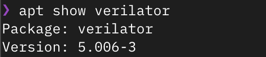
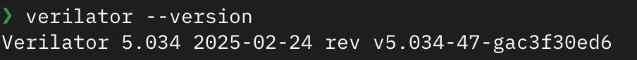
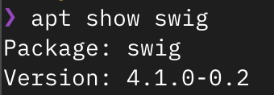
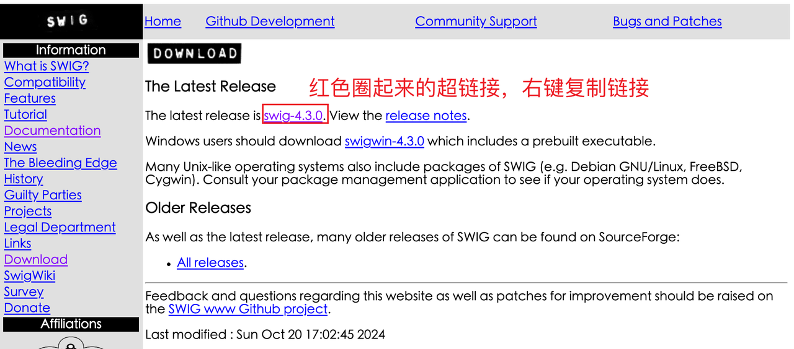
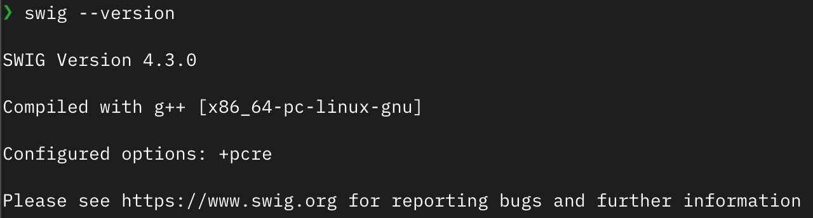
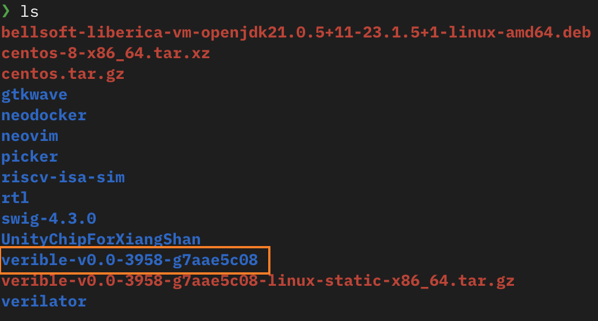
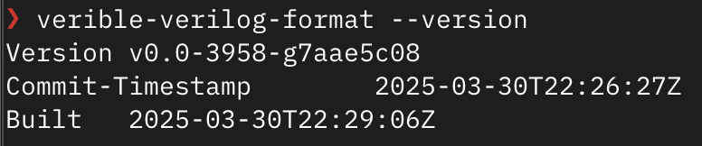
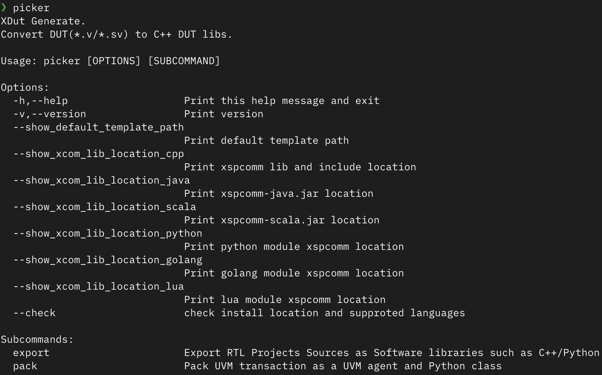
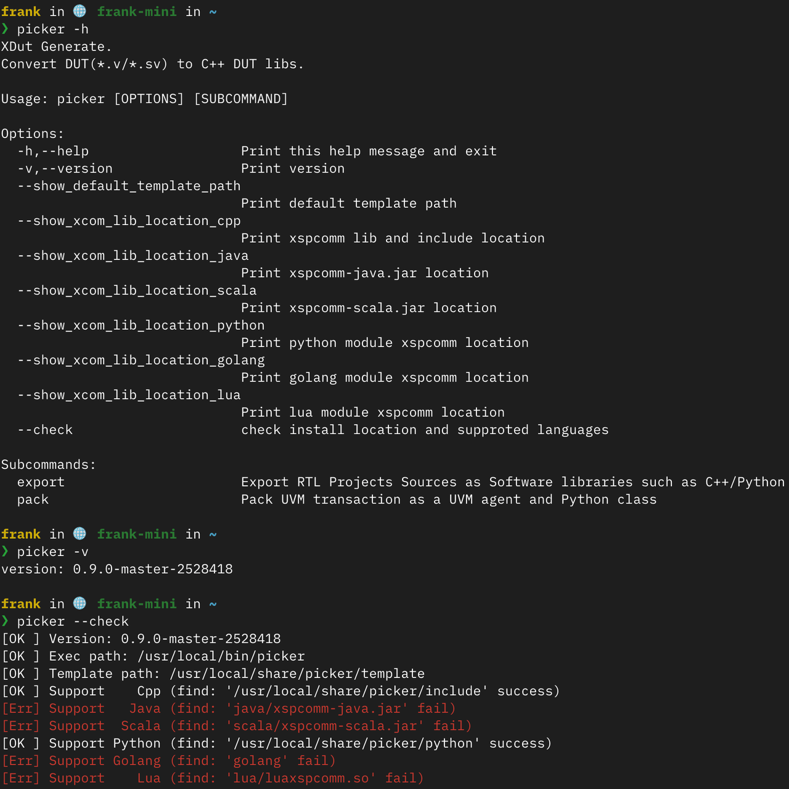
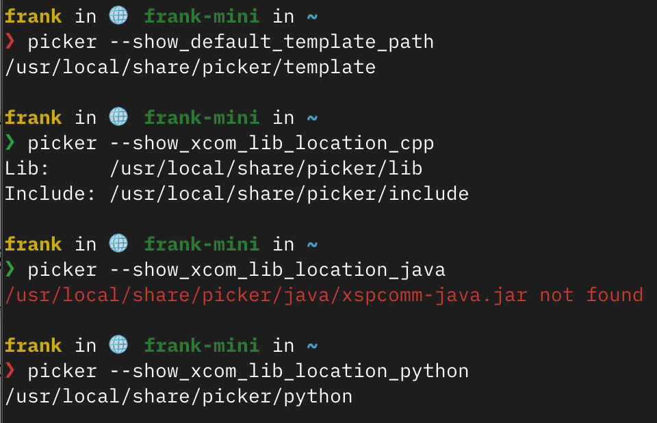



# 概览

本讲会介绍芯片验证辅助工具 Picker，该工具可将 RTL 设计模块打包为动态库，并提供多语言编程接口。

从这次课程开始，我们将使**Python**为芯片验证的高级语言，相关的示例也会用 Python 编写。

本次课程的主要内容包括：

* Picker 工具简介及优势

* 安装配置流程（Verilator、Swig、Verible 等）

* 基本功能讲解（DUT 创建、端口操作、时钟控制）

* Picker 命令参数的详解

* 同步 FIFO 实践练习

通过学习，您将掌握如何使用 Picker 及 Python 进行高效芯片验证，提升验证效率。

# Picker 简介

Picker 是一个芯片验证辅助工具，具有两个主要功能：

1. **打包 RTL 设计验证模块：** Picker 可以将 RTL 设计验证模块（`.v/.scala/.sv`）打包成动态库，并提供多种高级语言（目前支持 C++、Python、Java、Scala、Golang）的编程接口来驱动电路

2. **UVM-TLM 事务封装到其他语言：** picker 能够基于用户提供的 UVM sequence\_item 进行自动化的 TLM 代码封装，提供 UVM 与其他高级语言（如 Python）的通信接口。 该工具允许用户基于现有的软件测试框架，例如 pytest、junit、TestNG、go test 等，进行芯片单元测试

基于 Picker 进行验证的优点：

1. 不泄露 RTL 设计：经过 Picker 转换后，原始的设计文件（`.v`）被转化成了二进制文件（`.so`），脱离原始设计文件后，依旧可进行验证，且验证者无法获取 RTL 源代码

2. 减少编译时间：当 DUT（设计待测）稳定时，只需要编译一次（打包成 `.so `文件）

3. 用户范围广：提供的编程接口多，覆盖不同语言的开发者

4. 使用丰富的软件生态：支持 Python3、Java、Golang 等生态系统

5. 自动化的 UVM 事务封装：通过自动化封装 UVM 事务，实现 UVM 和 Python 的通信

Picker 目前支持的 RTL 仿真器：

1. Verilator

2. Synopsys VCS

***

# Picker 的安装

在开始使用 Picker 进行芯片验证之前，我们需要先完成 Picker 及其依赖工具的安装。本节将介绍安装步骤和可能遇到的问题。

## Docker 镜像

我们提供了打包好的 Docker 镜像：

* 包含 Picker：`ghcr.io/xs-mlvp/envbase:latest`

* 包含 Picker 和 Toffee：`ghcr.io/xs-mlvp/envfull:latest`

具体用法请查阅：[https://github.com/XS-MLVP/tutorial-records](https://github.com/XS-MLVP/tutorial-records)

## 系统要求

Picker 需要在 Linux 系统环境下运行，推荐使用以下发行版：

1. Debian 12/13

2. Ubuntu 22.04/24.04


> **注意**：以下命令仅保证在上述列举的 Linux 发行版中正常工作，如果您使用其他发行版，遇到问题请自行解决。

## 依赖安装

Picker 依赖于以下工具：

1. 基本编译工具（如 gcc、cmake 等）

2. lcov

3. Verilator

4. Swig

5. Verible

接下来，我们会逐步完成这些依赖工具的安装。

### 安装基本编译工具

```bash
sudo apt install -y build-essential git cmake python3-venv libpython3-dev time lcov
```

### 安装 Verilator

#### 检查可用版本

首先查看包管理工具提供的 Verilator 版本：

```bash
apt show verilator
```



如上图所示，如果版本号（Version） **≥ 4.218**，可以通过包管理器直接安装：

```bash
sudo apt install -y verilator
```

否则，需要编译安装 Verilator，建议安装最新版本。

> **注意**：从 Verilator 5.030 开始，代码覆盖率统计结果的合并策略发生了变化，但不影响功能验证。

#### 编译安装 Verilator

获取源代码：

```bash
# 从 github 拉取代码
git clone https://github.com/verilator/verilator.git
# 注意！！！如果拉取失败，可以考虑用下面的命令从 gitee 拉取
git clone https://gitee.com/mirrors/Verilator verilator

# 进入仓库
cd verilator
```

然后切换分支到稳定版、安装编译依赖的工具，然后再进行编译安装：

```bash
# 切换分支
git checkout stable
# 安装依赖
sudo apt install -y help2man perl perl-doc flex bison autoconf

# 编译
autoconf
./configure
make -j
# 安装
sudo -E make install
```

然后在命令行里输入`verilator --version`，出现类似下图内容表示安装成功：



## 检查可用版本

首先查看包管理工具提供的 Swig 版本：

```bash
apt show swig
```



如上图所示，如果版本号（Version） 如果版本号 **≥ 4.2.0**，可以通过包管理器直接安装：

```bash
sudo apt install -y swig
```

否则，需要编译安装 swig，建议安装最新版本。

### Swig 编译安装

如果你先前通过包管理器安装了 Swig，请先删除：

```bash
sudo apt purge -y swig
```

首先打开 Swig 源码的下载网站 https://www.swig.org/download.html

<center></center>

截止在编写教程时，我们得到源码的链接为`wget http://prdownloads.sourceforge.net/swig/swig-4.3.1.tar.gz`

> ❓如果我打开的 swig 网站版本跟截图里的不一样，该怎么办？
> 没有问题，不低于 4.2.0 就行。

随后在 Linux 中下载 swig 的源码：

```bash
# 注意！下载的版本号可能不一样，以实际下载结果为准
# 下载 swig 源码. 如果你对 Linux 比较熟悉，可以使用你喜欢的方法下载
sudo apt install -y wget # 安装wget
wget http://prdownloads.sourceforge.net/swig/swig-4.3.1.tar.gz

tar xvf swig-4.3.1.tar.gz # 在当前目录解压缩
cd swig-4.3.1 # 进入源码文件夹

sudo apt install -y python3-pip libpcre2-dev # 安装依赖
# 编译
./configure
make -j
# 安装
sudo -E make install
```

执行命令`swig --version`，出现类似下图内容表示安装成功：



## 安装 Verible

从 GitHub 下载 Verible 的二进制程序：https://github.com/chipsalliance/verible/releases

### 下载

下载 verible 的二进制程序（x86）并解压缩：

```bash
# 注意！下载的版本号可能不一样，以实际下载结果为准
# 下载 verible, 如果你对 Linux 比较熟悉，可以使用你喜欢的方法下载
sudo apt install -y wget # 安装wget
wget https://github.com/chipsalliance/verible/releases/download/v0.0-3958-g7aae5c08/verible-v0.0-3958-g7aae5c08-linux-static-x86_64.tar.gz

# 解压缩
tar xvf verible-v0.0-3958-g7aae5c08-linux-static-x86_64.tar.gz
```

> ⚠️警告：你需要把解压缩后的文件夹妥善安放在一个目录里，在环境变量配置好后不要移动

### 配置环境变量

在命令行中执行：

```bash
echo $SHELL
```

如果输出包含`bash`，说明使用的是 Bash Shell。以下配置基于 Bash，其他 Shell 请自行调整。

随后来到 verible 解压缩后所在的文件夹，以教程为例，输入`ls`命令后，能看到`verible-v0.0-3958-g7aae5c08-linux-static-x86_64`文件夹：



之后添加环境变量：

```bash
# verible-v0.0-3958-g7aae5c08 以实际下载结果为准，然后替换成你解压缩后的文件夹
echo "export PATH=\$PATH:$(realpath verible-v0.0-3958-g7aae5c08)/bin" >> ~/.bashrc
source ~/.bashrc
```

执行`verible-verilog-format --version`，出现类似下图内容表示安装成功：



## Picker 的安装

完成所有依赖工具的安装后，现在可以安装 Picker 本身。

首先下载 Picker 的源码并进入仓库：

```bash
git clone https://github.com/XS-MLVP/picker.git --depth=1
cd picker
```

然后构建并安装：

```bash
make # 编译
sudo -E make install # 安装
```

> ⚠️注意：可通过 `make BUILD_XSPCOMM_SWIG=python,java,scala,golang,lua -j`开启其他语言的支持。各语言的开发环境需要自行配置。

安装完成后，执行`picker`命令可以得到以下输出：



完成安装后，运行以下示例验证安装是否正确：

```shell
bash example/Adder/release-verilator.sh --lang python
bash example/RandomGenerator/release-verilator.sh --lang python
```

成功运行后，您将看到对[加法器](https://open-verify.cc/mlvp/docs/quick-start/eg-adder/)和[随机数生成器](https://open-verify.cc/mlvp/docs/quick-start/eg-rmg/)的测试过程及结果。

***

# Picker 的基本功能

成功安装 Picker 后，我们将学习如何使用它进行 DUT（Design Under Test，待测设计）的创建和操作方法。

## DUT 的创建

以[随机数生成器](https://open-verify.cc/mlvp/docs/quick-start/eg-rmg/)为例。

首先，创建一个 `example` 文件夹，然后进入。

> 注意，后面的操作都在 `example` 文件夹中

在 example 文件夹中创建`RandomGenerator.v`文件，内容为：

```verilog
module RandomGenerator (
    input wire clk,
    input wire reset,
    input [15:0] seed,
    output [15:0] random_number
);
    reg [15:0] lfsr;

    always @(posedge clk or posedge reset) begin
        if (reset) begin
            lfsr <= seed;
        end else begin
            lfsr <= {lfsr[14:0], lfsr[15] ^ lfsr[14]};
        end
    end

    assign random_number = lfsr;
endmodule
```

### 创建 DUT 类

使用 Picker 的`export`命令创建 DUT 类：

```bash
picker export RandomGenerator.v --sname RandomGenerator -w RandomGenerator.fst --lang python --sim verilator
```

**命令参数解释**：

1. `RandomGenerator.v`：指定 RTL 设计文件

2. `--sname RandomGenerator`：指定顶层模块名称

3. `-w RandomGenerator.fst`：启用波形输出，指定波形文件名

4. `--lang python`：生成 Python 的 DUT

5. `--sim verilator`：使用 Verilator 作为仿真器

执行完成后，会生成一个同名文件夹，其中包含 DUT 类`DUTRandomGenerator`，目录结构为：

```plaintext
.
├── RandomGenerator # 由Picker生成
│   ├── example.py
│   ├── __init__.py
│   ├── libUT_RandomGenerator.py
│   ├── libUTRandomGenerator.so
│   ├── pli.tab
│   ├── signals.json
│   ├── _UT_RandomGenerator.so
│   └── xspcomm
└── RandomGenerator.v # 随机数生成器的设计文件
```

#### 实例化 DUT 类

现在可以通过 Python 代码实例化 DUT 类，创建`test_dut.py`文件：

```python
from RandomGenerator import *

if __name__ == "__main__": 
    dut = DUTRandomGenerator() # 创建DUT
    dut.Finish()
```

通过`python3 test_dut.py`就能成功运行此文件。

在上面的代码中，我们先实例化了随机数生成器的 DUT，之后再调用了 `dut.Finish()`方法。

#### 关于`Finish()`方法

`Finish()`方法是仿真控制中的关键函数，它具有以下重要功能：

1. **结束仿真**：正常终止仿真进程

2. **保存波形文件**：将仿真过程中记录的波形数据写入指定格式的文件（如。fst)

3. **生成覆盖率文件**：如果启用了覆盖率收集，会生成相应的覆盖率数据文件

4. **释放资源**：清理仿真过程中分配的内存和其他系统资源

如果需要生成波形文件或覆盖率报告，务必在仿真结束时调用`Finish()`方法。否则，波形和覆盖率数据将不会被保存。

## 操作 DUT

创建 DUT 类后，我们需要学习如何操作它，包括读写端口、控制时钟以及监控内部信号。

本节将使用随机数生成器作为示例，详细介绍 DUT 操作的各个方面，并会使用`DUTRandomGenerator`的实例展示相关操作。

假定目录结构如下：

```plaintext
.
├── RandomGenerator
│   ├── example.py
│   ├── __init__.py
│   ├── libUT_RandomGenerator.py
│   ├── libUTRandomGenerator.so
│   ├── pli.tab
│   ├── signals.json
│   ├── _UT_RandomGenerator.so
│   └── xspcomm
│
├── example.py # 假设代码都为位于该文件中
└── RandomGenerator.v # 随机数生成器的设计文件
```

### 端口操作

DUT 的所有端口及其导出的内部信号都以成员变量的形式定义在该 DUT 类。这些成员变量的类型为 XData 类型，Picker 用该类型对电路引脚的数据进行表示。

我们可以通过以下方式读取信号的值：

```python
from RandomGenerator import *

if __name__ == "__main__": 
    dut = DUTRandomGenerator()           # 创建DUT 
    rand = dut.random_number.value       # 读取引脚random_number的值, 与 `rand = dut.random_number.U()` 等价
    rand_lsb = dut.random_number[0]      # 读取引脚random_number的最低位
    rand_signed = dut.random_number.S()  # 按有符号类型读取引脚random_number的值
    dut.Finish()
```

如果要对端口赋值：

```python
from RandomGenerator import *

if __name__ == "__main__": 
    dut = DUTRandomGenerator()    # 创建DUT 
    dut.seed.value = 12345        # 十进制赋值
    dut.seed.value = 0b11011      # 二进制赋值
    dut.seed.value = 0o12345      # 八进制赋值
    dut.seed.value = 0x12345      # 十六进制赋值
    dut.seed.value = -1           # 所有bit赋值1
    x = 3
    dut.seed.value = x            # 与 a.Set(x) 等价
    dut.seed[1] = 0               # 对第1位进行赋值
    dut.seed.value = "x"          # 赋值高阻态
    dut.seed.value = "z"          # 赋值不定态
    dut.Finish()
```

### XData 写入模式

在Picker 中，XData 是电路引脚数据的表示方式，支持三种不同的写模式：

* **立即写模式（Imme）** ：数据立即写入目标，不依赖时钟

* **上升沿写模式（Rise）** ：数据仅在时钟信号的上升沿时被写入目标。**这是默认的写入模式**

* **下降沿写模式（Fall）** ：数据仅在时钟信号的下降沿时被写入目标

这三种写模式可以通过`SetWriteMode()`方法，或使用`AsImmWrite()`、`AsRiseWrite()`和`AsFallWrite()`直接切换写入模式。

```python
from RandomGenerator import *

if __name__ == "__main__": 
    dut = DUTRandomGenerator() # 创建DUT 
    dut.seed.AsRiseWrite()     # seed切换为上升沿写入，默认模式
    dut.seed.AsFallWrite()     # seed切换为下降沿写入
    dut.seed.AsImmWrite()      # seed切换为立即写入
```

### 导出内部信号

除了模块的引脚信号外，我们可能需要访问 DUT 内部的信号。Picker 提供了导出内部信号的机制，分为静态导出和动态获取两种方法。

#### 静态导出

我们把需要访问的内部信号写入`yaml`文件后，就可以通过 DUT 类获取内部的信号。

在随机数生成器的代码中，内部定义了一个`lfsr`寄存器，要想通过 DUT 类中访问，我们先要创建`internal.yaml`文件，内容为：

```yaml
RandomGenerator:
    - "reg [15:0] lfsr"
```

然后在原有命令的基础上，添加新的参数`--internal ./internal.yaml`，完整的命令如下：

```bash
rm -r RandomGenerator # 记得删除之前创建的文件夹
picker export RandomGenerator.v -w RandomGenerator.fst --lang python --sim verilator --internal ./internal.yaml
```

这样就可以通过 DUT 类访问内部信号，导出的内部信号的名字遵循`模块名_信号名`的规则，例如`RandomGenerator_lfsr`。

#### 动态获取

动态获取有两种方式：

* 通过 VPI（默认开启）

* 通过 Mem-Direct（有更好的性能）

如果想通过 Mem-Direct 的模式访问，需要在原命令的基础上添加新参数`--rw 1`，需要注意的是该模式只支持 Verilator，完整的命令如下：

```bash
rm -r RandomGenerator # 记得删除之前创建的文件夹
picker export RandomGenerator.v -w RandomGenerator.fst --lang python --sim verilator --rw 1
```

这样就可以通过：

* `GetInternalSignalList`：列出所有的内部信号

* `GetInternalSignal("name")`：动态访问内部信号

```python
from RandomGenerator import DUTRandomGenerator

if __name__ == "__main__": 
    dut = DUTRandomGenerator()
    # 初始化时钟，参数时钟引脚对应的名称，例如clk
    dut.InitClock("clk")               
    # 列出所有内部信号
    print(dut.GetInternalSignalList()) 
    # 动态访问
    name = "RandomGenerator_top.RandomGenerator.lfsr"
    lfsr = dut.GetInternalSignal(name)
    # 打印值
    print(lfsr.value) 
```

### 时钟操作

`XClock`是电路时钟的封装，用于控制时钟相关的操作。在传统仿真工具（例如 Verilator）中，需要手动为时钟信号赋值。但在 Picker 中，我们提供了相应的方法，可以把时钟引脚直接绑定到 XClock 上。只需要通过`Step()`方法，就可以同时更新时钟信号和电路状态。

每个 DUT 类均包含`xclock`成员变量（类型为`XClock`），它是驱动仿真时序的核心组件，通过：

* `Step()`：控制时钟推进并更新电路状态

* `StepRis()`：控制上升沿触发逻辑

* `StepFal()`：控制下降沿触发逻辑

`xclock`还会直接绑定时钟端口实现信号同步更新，同时为波形记录、覆盖率采集等功能提供全局时序事件支持，DUT 类中所有时钟操作均通过调用`xclock`的接口实现。

#### 时钟的绑定和驱动

RandomGenerator 的时钟端口是`clock`，我们可以通过`InitClock`方法绑定时钟端口，使用`Step`方法驱动时钟、刷新电路状态：

```python
from RandomGenerator import *

if __name__ == "__main__": 
    dut = DUTRandomGenerator()
    # 初始化时钟，参数时钟引脚对应的名称，例如clk
    dut.InitClock("clk") 
    
    dut.reset.value = 1
    # 时钟推进到下一个上升沿之前，与 `dut.xclock.Step()` 等价
    dut.Step()
    dut.reset.value = 0
    # 时钟推进到后5个上升沿之前，与 `dut.xclock.Step(5)` 等价
    dut.Step(5)
    dut.Finish()
```

> **提示**：`Step()`方法并不是真的推进一个完整周期，而是推进到下一个上升沿之前。观察波形可以更好地理解时钟信号的变化关系。

异步编程是实现电路并发驱动的重要手段，Picker 也提供了异步环境下的时钟方法：

* `AStep(cycle: int)`：异步等待时钟经过 cycle 个周期， 例如：`await dut.AStep(5)`

* `ACondition(condition)`：异步等待条件为真，注意`condtion`是一个返回布尔值的**函数对象**

* `RunStep(cycle: int)`：驱动时钟信号，持续推进时钟 cycle 个时钟

> 后面几讲会详细介绍异步编程相关的内容，这里简单先了解 Picker 提供的异步方法。

```python
import asyncio
from RandomGenerator import *


def pin_value_is_beef(dut: DUTRandomGenerator):
    def is_beef() -> bool:
        return dut.random_number.value == 0xBEEF

    return is_beef # 返回的不是 is_beef()


async def example_async(dut: DUTRandomGenerator):
    print("Reset start.")
    dut.seed.value = 0xBEEF
    dut.reset.value = 1

    print("Wait condition")
    await dut.ACondition(pin_value_is_beef(dut))  # 等待引脚信号变为0xBEEF
    # 等价于 await dut.ACondition(lambda: dut.random_number.value == 0xBEEF)

    dut.reset.value = 0
    print("Wait 1 clock")
    await dut.AStep(1)  # 等待时钟经过1个周期, 与 `dut.xclock.AStep(1)` 等价
    print("Reset done.")


async def main(dut: DUTRandomGenerator):
    asyncio.create_task(example_async(dut))
    await asyncio.create_task(dut.RunStep(10))  # 让时钟持续推进 10 个周期


if __name__ == "__main__":
    dut = DUTRandomGenerator()
    dut.InitClock("clk")  # 初始化时钟，参数时钟引脚对应的名称，例如clk
    asyncio.run(main(dut))
    dut.Finish()
```

> ❓问题：如果把`dut.RunStep(10)`修改为`dut.RunStep(1)`，还会打印`Reset done.`吗？

#### 注册回调函数

回调函数允许在时钟的特定边沿执行自定义操作，通过`StepRis`和`StepFal`方法注册。时钟的回调函数必须至少有一个参数，传入的第一个参数是当前的周期数。

在下面的例子中，回调函数`callback`会在注册完成之后，在每个周期的上升沿输出当前的周期数；如果`reset`信号置高，还会输出`DUT reset.`。

```python
from RandomGenerator import *

def callback(cycles, reset):
    print(f"The current clock cycle is {cycles}")
    if reset.value:
        print("DUT reset.")

if __name__ == "__main__": 
    dut = DUTRandomGenerator()
    # 初始化时钟，参数时钟引脚对应的名称，例如clk
    dut.InitClock("clk")
    # 注意！传入的是 callback，不是 callback()
    dut.StepRis(callback, [dut.reset]) 
    
    # 驱动时钟
    dut.Step()
    dut.reset.value = 1
    dut.Step(5)
    dut.reset.value = 0
    dut.Step(4)
    dut.Finish()
```

> **注意**：传入的是回调函数名`callback`，而不是函数调用`callback()`。
> 更完整的回调函数案例可以参考[双端口栈（回调）](https://open-verify.cc/mlvp/docs/quick-start/eg-stack-callback)。

## 波形的动态开启与关闭（仅 Verilator 支持）

如果在导出 DUT 的时候开启了`-w`之后，我们还可以动态地控制波形的开启和关闭：

* `CloseWaveform()`：关闭波形导出，仍然会创建波形文件，但不会写入文件；最好在调用前执行`RefreshComb()`，刷新一下电路

* `OpenWaveform()`：开启波形导出

我们在刚刚注册回调函数的例子中，添加关闭和开启波形的代码：

```python
from RandomGenerator import *

def callback(cycles, reset):
    print(f"The current clock cycle is {cycles}")
    if reset.value:
        print("DUT reset.")

if __name__ == "__main__": 
    dut = DUTRandomGenerator()
    # 初始化时钟，参数时钟引脚对应的名称，例如clk
    dut.InitClock("clk")
    # 注意！传入的是 callback，不是 callback()
    dut.StepRis(callback, [dut.reset]) 
    
    dut.RefreshComb()   # 刷新电路
    dut.CloseWaveform() # 关闭波形
    dut.Step()
    dut.reset.value = 1
    dut.Step(5)
    dut.dut.OpenWaveform() # 开启波形
    dut.reset.value = 0
    dut.Step(4)
    dut.Finish()
```

打开波形文件可以发现，波形直接记录了`reset`信号保持 4 个低电平的状态。

## 用 `assert` 编写验证代码

在熟悉如何操作之后，我们就可以编写验证代码了，一般通过 `assert` 来判断结果的正确性。

`assert` 是 Python 中的一个关键词，它有两种使用格式：

```python
assert 布尔表达式
assert 布尔表达式, "提示字符串"
```

其中，布尔表达式部分要编写我们认为是正确的情况；提示字符串是可选部分，当表达式的结果为假时，会输出提示字符串的内容。

比如说，我们希望随机数生成器的结果为 `114514`，那么我们可以写：

```python
assert dut.random_number.value == 114514, "Mismatch"
```

如果随机数生成器的结果不是 `114514`，那么最终会输出 "Mismatch"。

### 随机数生成器的验证代码

下面就是随机数生成器的验证代码：

```python
from RandomGenerator import *
import random

# 定义参考模型
class LFSR_16:
    def __init__(self, seed):
        self.state = seed & ((1 << 16) - 1)

    def Step(self):
        new_bit = (self.state >> 15) ^ (self.state >> 14) & 1
        self.state = ((self.state << 1) | new_bit ) & ((1 << 16) - 1)

if __name__ == "__main__":
    dut = DUTRandomGenerator()            # 创建DUT 
    dut.InitClock("clk")                  # 指定时钟引脚，初始化时钟
    seed = random.randint(0, 2**16 - 1)   # 生成随机种子
    dut.seed.value = seed                 # 设置DUT种子
    # reset DUT
    dut.reset.value = 1                   # reset 信号置1
    dut.Step()                            # 推进一个时钟周期（时序电路，需要通过Step推进）
    dut.reset.value = 0                   # reset 信号置0
    dut.Step()                            # 推进一个时钟周期
    
    ref = LFSR_16(seed)                   # 创建参考模型用于对比

    for i in range(65536):                # 循环65536次
        dut.Step()                        # dut 推进一个时钟周期，生成随机数
        ref.Step()                        # ref 推进一个时钟周期，生成随机数
        rand = dut.random_number.value
        assert rand == ref.state, "Mismatch"  # 对比DUT和参考模型生成的随机数
        print(f"Cycle {i}, DUT: {rand:x}, REF: {ref.state:x}") # 打印结果
    # 完成测试
    print("Test Passed")
    dut.Finish()    # Finish函数会完成波形、覆盖率等文件的写入

```

在这里，我们用 Python 代码实现了一个类`LSRF_16`，它被用来模拟设计模块的预期行为，被称为**参考模型**。

最终，我们通过一个循环，把设计模块每个周期的输出和参考模型的输出进行对比。当循环结束且没有报错，就代表这个模块的验证结束并且没有发现错误。

---

# 覆盖率的收集导出

> 💡可选阅读部分：在下一讲会有更详细的介绍。

接下来将介绍如何导出代码覆盖率和功能覆盖率。

对于代码覆盖率，**需要保证在 Picker 创建 DUT 时添加`-c`参数**，启动代码行覆盖率的自动收集。

如果使用 Python 来验证硬件，功能覆盖率的收集需要使用 toffee 和 toffee-test：

- toffee 是一个基于 Python的验证框架。

- toffee-test 是一个用于为 toffee 框架提供测试支持的 Pytest 插件，它提供了测试报告生成功能。

我们会在下一讲中详细介绍 toffee 和 toffee-test 的安装与使用，或者参考[仓库文档](https://github.com/XS-MLVP/toffee-test/)。这里只介绍如何使用 toffee-test 提供的覆盖率收集功能，以及如何导出收集的结果。

## 功能覆盖率的收集

编写**覆盖点（Cover point）**&#x524D;，首先需要创建一个**覆盖组（Cover group）**，并指定覆盖组的名称

```python
import toffee.funcov as fc
g = fc.CovGroup("Group-A")
```

接着，需要往这个覆盖组中添加覆盖点。一般情况下，一个功能点对应一个或多个覆盖点，用来检查是否满足该功能。例如我们需要检查`Adder`的`cout`是否有`0`出现，我们可以通过如下方式添加：

```python
# add_cover_point是等价
g.add_watch_point(adder.io_cout,
                  {"io_cout is 0": fc.Eq(0)},
                  name="cover_point_1")
```

在上述覆盖点中，需要观察的数据为`io_cout`引脚，**覆盖仓（Cover bin）**&#x7684;名称为`io_cout is 0`，覆盖点名称为`cover_point_1`。函数`add_watch_point`的参数说明如下：

```python
def add_watch_point(target,
                    bins: dict,
                    name: str = "", once=None):
        """
        @param target: 检查目标，可以是一个引脚，也可以是一个DUT对象
        @param bins: 覆盖仓，dict格式，key为条件名称，value为具体检查方法或者检查方法的数组。
        @param name: 覆盖点名称
        @param once，如果once=True，表明只检查一次，一旦该覆盖点满足要求后就不再进行重复条件判断。
```

通常情况下，`target`为`DUT`引脚，`bins`中的检查函数来检查`target`的`value`是否满足预定义条件。`funcov`模块内存了部分检查函数，例如`Eq(x), Gt(x), Lt(x), Ge(x), Le(x), Ne(x), In(list), NotIn(list), isInRange([low,high])`等。当内置检查函数不满足要求时，也可以自定义，例如需要跨时钟周期进行检查等。自定义检查函数的输入参数为`target`，返回值为`bool`。例如：

```python
g.add_watch_point(adder.io_cout,
                  {
                    "io_cout is 0": lambda x: x.value == 0,
                    "io_cout is 1": lambda x: x.value == 1,
                    "io_cout is x": fc.Eq(0),
                    # 注：zx态，vcs后端支持，verilator不支持
                  },
                  name="cover_point_1")
```

当添加完所有的覆盖点后，需要在`DUT`的`Step`回调函数中调用`CovGroup`的`sample()`方法进行判断。在检查过程中，或者测试运行完后，可以通过`CovGroup`的`as_dict()`方法查看检查情况。

```python
dut.StepRis(lambda x: g.sample())

...

print(g.as_dict())
```

## 导出覆盖率文件

在测试`case`每次运行结束时，可以通过`set_func_coverage(request, cov_groups)`告诉框架对所有的功能覆盖情况进行合并收集。相同名字的`CoverGroup`会被自动合并。

下面是一个简单的例子，通过`pytest . -sv`运行：

```python
import pytest
import toffee.funcov as fc
from toffee_test.reporter import set_func_coverage

g = fc.CovGroup("Group X")

def init_function_coverage(g):
    # add your points here
    pass

@pytest.fixture()
def dut_input(request):
    # before test
    init_function_coverage(g)
    dut = DUT()
    dut.InitClock("clock")
    dut.StepRis(lambda x: g.sample())
    yield dut
    # after test
    dut.Finish()
    set_func_coverage(request, g)
    g.clear()

def test_case1(dut_input):
    assert True

def test_case2(dut_input):
    assert True

# ...
```

在上述例子中，每个`case`都会通过`dut_input`函数来创建输入参数。该函数用`yield`返回`dut`，在运行`case`前初始化`dut`，并且设置在`dut`的`step`回调中执行`g.sample()`。运行完`case`后，调用`set_func_coverage`收集覆盖率，然后清空收集的信息。在仿真结束后，会生成一个`V{DUT_NAME}.dat`文件。

## 生成报告并查看

如果我们想生成并查看报告，可以在运行命令后添加`--toffee-report`，会自动生成可视化的报告。

***

# 高级功能简介

XData 和 XClock 的全部功能，可以查看[工具介绍](https://open-verify.cc/mlvp/docs/env_usage/picker_usage/)

Picker 还提供了一些高级功能，能够满足更复杂的验证需求，譬如多实例和多时钟。

但是这里不会展开详细讲解，感兴趣可以查阅：

* 开放验证平台学习资源：https://open-verify.cc/mlvp/docs/env\_usage/

* picker 的 API 文档：https://github.com/XS-MLVP/picker/blob/master/doc/API.zh.md

如果你想查看更多的例子，picker 的仓库也提供了一些示例：https://github.com/XS-MLVP/picker/tree/master/example

***

# Picker 的命令参数

Picker 命令遵循以下基本结构：

```plaintext
picker [全局选项] <子命令> [子命令选项] <文件...>
```

主要子命令包括：

* `export`：将 RTL 项目源代码导出为软件库（如 C++/Python）

* `pack`：将 UVM 事务打包为 UVM 代理和 Python 类。但这里不会展开介绍，如果感兴趣请查阅文档。

## 全局选项参数

Picker 的全局选项用于获取帮助信息、查看版本以及定位各种库文件路径。这些选项可以在不指定子命令的情况下直接使用。

### 基本帮助和版本选项

`-h, --help`：打印帮助信息并退出。这是了解 Picker 基本用法的首选选项。

`-v, --version`：显示 Picker 的版本号。在报告问题或确认兼容性时非常有用。

`--check`：检查安装位置和支持的语言。这个选项可以帮助您验证 Picker 的安装状态和当前环境支持的所有语言。



### 路径查询选项

以下选项用于查询 Picker 相关的各种路径信息，对于自定义开发和调试非常有用：

`--show_default_template_path`：显示默认模板路径。当需要自定义生成代码的模板时，这个选项可以帮助您找到原始模板文件的位置。

`--show_xcom_lib_location_cpp`：显示 C++版本 xspcomm 库和头文件的位置。在手动集成 C++项目时使用。

`--show_xcom_lib_location_java`：显示 Java 版本 xspcomm-java.jar 的位置。在 Java 项目中使用 Picker 生成的代码时需要。

`--show_xcom_lib_location_scala`：显示 Scala 版本 xspcomm-scala.jar 的位置。用于 Scala 项目集成。

`--show_xcom_lib_location_python`：显示 Python 模块 xspcomm 的位置。在自定义 Python 环境中使用时很有帮助。

`--show_xcom_lib_location_golang`：显示 Go 语言模块 xspcomm 的位置。用于 Go 项目集成。

`--show_xcom_lib_location_lua`：显示 Lua 模块 xspcomm 的位置。在 Lua 环境中使用 Picker 生成的代码时需要。



## `export` 子命令常用参数

`export`是最常用的子命令，用于生成 DUT 接口。以下是其关键参数的详细解释：

### 必要参数

`file`：指定 DUT 的顶层。v/.sv 源文件，必须包含顶层模块。这是唯一的必需参数。

### 输入文件相关参数

`--fs, --filelist`：指定 DUT 的.v/.sv 源文件列表，可以用逗号分隔或使用。txt 文件（每行一个 RTL 文件路径）。当设计包含多个文件时非常有用。

`--sname, --source_module_name`：指定要处理的 RTL 模块名称。默认情况下，Picker 会选择用`-f`标记文件中的最后一个模块作为顶层模块。

`--internal`：导出内部信号配置文件路径。默认为空，表示不导出内部引脚。当需要访问 DUT 内部信号时使用。

### 输出控制参数

`--lang, --language`：构建目标项目的语言，默认为 python。支持的选项包括 python/cpp/java/scala/golang/lua。

`--tname, --target_module_name`：设置目标 DUT 的模块名和文件名。默认与源模块名相同。例如，使用`--tname top`将生成 UTtop.cpp 和 UTtop.hpp 文件，包含 UTtop 类。

`--tdir, --target_dir`：存储所有结果的目标目录。如果以'/'结尾或为空，目录名将与目标模块名相同。

`--sim`：选择仿真器，支持 vcs 或 verilator。默认为 verilator。

`--e, --example`：是否构建示例项目，默认为 OFF。启用此选项会生成基本的使用示例。

`--autobuild`：是否自动构建生成的项目，默认为 true。设置为 false 可以只生成文件而不编译。

### 仿真功能参数

`--w, --wave_file_name`：波形文件名，为空表示不导出波形。指定文件名将启用波形记录功能。

`--c, --coverage`：是否启用覆盖率收集，默认为 OFF。启用后可以生成覆盖率报告。

`--checkpoints`：是否启用覆盖点（保存/恢复功能），默认为 OFF。启用后可以保存和恢复仿真状态。

`--vpi`：是否启用 VPI（用于灵活访问内部信号），默认为 OFF。VPI 提供了更灵活的信号访问方式。

`--F, --frequency`：设置**仅 VCS**&#x7684; DUT 频率，默认为 100MHz。单位可以是 Hz/KHz/MHz/GHz。

### 编译选项参数

`--V, --vflag`：传递给仿真器的用户自定义编译参数。例如`-v -x-assign=fast -Wall --trace`或`-C vcs -cc -f filelist.f`。

`--C, --cflag`：用户自定义的 gcc/clang 编译命令，直接传递给编译器。例如`-O3 -std=c++17 -I./include`。

`--verbose`：是否启用详细输出模式，默认为 OFF。启用后会显示更多调试信息。

***

# 练习

本讲的练习已经发布在新手任务中，请查阅[学习任务1: Picker 部分](../../task/picker)。

