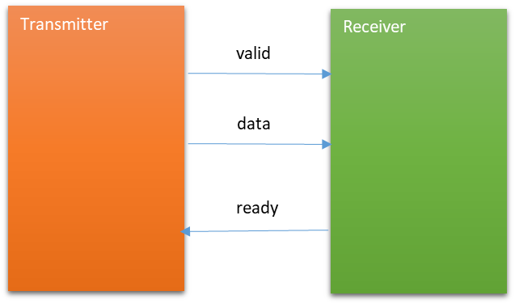
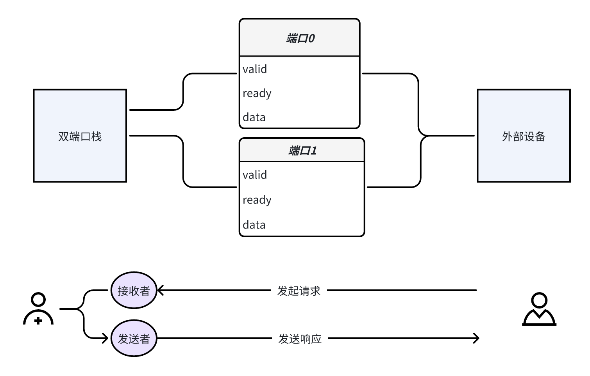
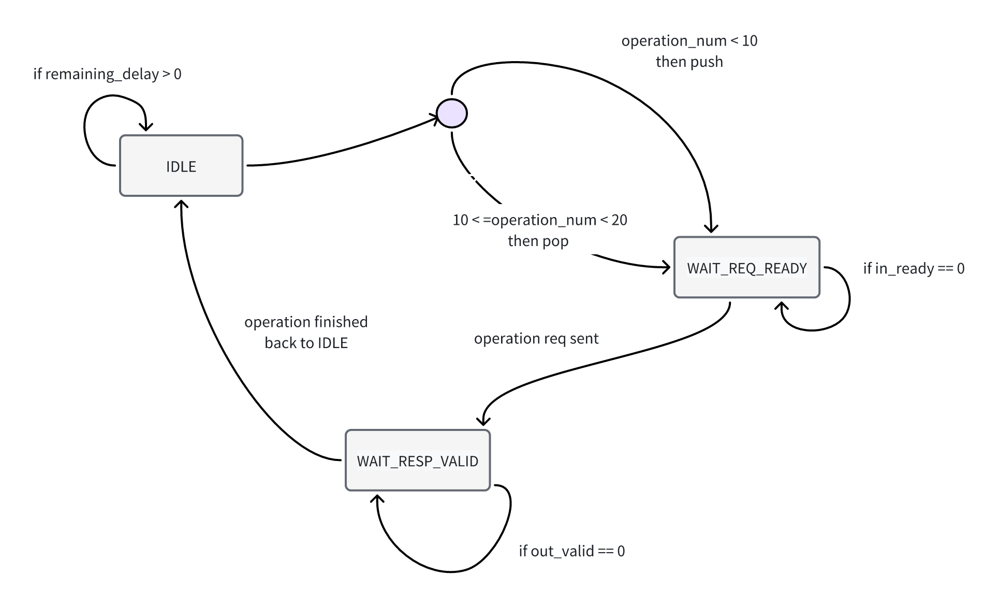
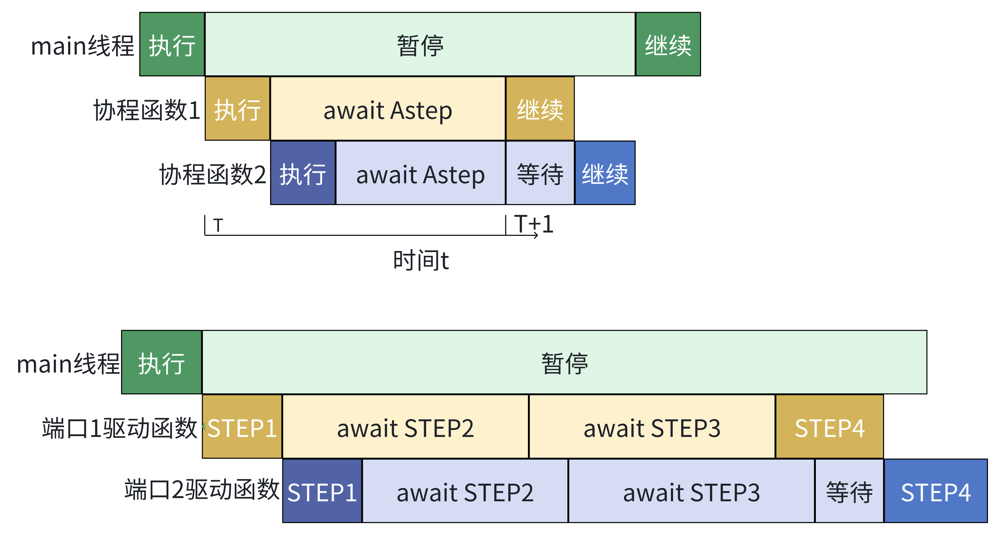

<center><iframe src="//player.bilibili.com/player.html?isOutside=true&aid=115031941320894&bvid=BV1T4bnz4EEB&cid=31709462687&p=1&autoplay=0" scrolling="no" border="0" frameborder="no" framespacing="0" allowfullscreen="true" style="width:80%; aspect-ratio: 16/9"></iframe></center>

# 简介

在完成前三讲的学习后，我们已经掌握了芯片验证的基础概念（第一讲），了解了如何使用 Picker 工具生成和基本操作 DUT（第二讲），并初步接触了 Toffee 验证框架及其核心的异步编程思想（第三讲）。本讲将进入一个**进阶应用案例**，旨在将先前学习的知识应用于一个更接近实际工程复杂度的场景。

本讲的核心目标是学习和演示在只使用 picker 的前提下，如何处理**并发接口**的验证，这是芯片验证中常见且重要的挑战。我们将以**双端口栈**为例，该设计允许两个端口同时进行独立的读写操作。

为了应对这种并发性，我们将探讨并实践两种不同的驱动方法：

1. **基于回调函数的状态机**：一种传统的处理并发事件的方式。

2. **基于协程的异步驱动**：利用 Picker 提供的异步接口和 Python 内置的 `asyncio` 库。这种方法直接应用了第三讲中介绍的 `async/await` 异步编程**原理**。

通过对比这两种方法，你将能更深刻地理解：

* 处理并发验证问题的不同策略及其优缺点。

* 异步编程模型（如 `async/await` 和协程）相比传统回调函数，在简化并发逻辑、避免复杂状态机方面的优势。

* 虽然本例未使用完整的 Toffee 框架，但它所演示的协程方法是 Toffee 这类现代验证框架的核心基础，理解它是掌握 Toffee 的关键一步。

* 如何将在前几讲学习的基础工具（Picker）和编程概念（异步）应用于解决具体的、具有挑战性的验证问题。

# 双端口栈介绍

双端口栈是一种数据结构，支持两个端口同时进行操作。与传统单端口栈相比，双端口栈允许同时进行数据的读写操作，在例如多线程并发读写等场景下，双端口栈能够提供更好的性能。本例中，我们提供了一个简易的双端口栈实现，其源码如下：

```verilog
// dual_port_stack.v
module dual_port_stack (
    input clk,            // 时钟信号
    input rst,            // 异步复位信号

    // 接口 0
    input in0_valid,      // 接口0的输入有效信号
    output in0_ready,     // 接口0的模块就绪信号
    input [7:0] in0_data, // 接口0的输入数据
    input [1:0] in0_cmd,  // 接口0的命令（PUSH或POP）
    output out0_valid,    // 接口0的输出有效信号
    input out0_ready,     // 接口0的接收端准备好接收输出数据
    output [7:0] out0_data, // 接口0的输出数据
    output [1:0] out0_cmd,  // 接口0的命令反馈（PUSH_OKAY 或 POP_OKAY）

    // 接口 1
    input in1_valid,      // 接口1的输入有效信号
    output in1_ready,     // 接口1的模块就绪信号
    input [7:0] in1_data, // 接口1的输入数据
    input [1:0] in1_cmd,  // 接口1的命令（PUSH或POP）
    output out1_valid,    // 接口1的输出有效信号
    input out1_ready,     // 接口1的接收端准备好接收输出数据
    output [7:0] out1_data, // 接口1的输出数据
    output [1:0] out1_cmd   // 接口1的命令反馈（PUSH_OKAY 或 POP_OKAY）
);

    // 命令定义
    localparam CMD_PUSH     = 2'b00; // 入栈
    localparam CMD_POP      = 2'b01; // 出栈
    localparam CMD_PUSH_OKAY = 2'b10; // 入栈确认
    localparam CMD_POP_OKAY  = 2'b11; // 出栈确认

    // 栈内存（256字节）和栈指针
    reg [7:0] stack_mem[0:255]; // 栈内存
    reg [7:0] sp;               // 栈指针，指向下一个空位
    reg busy;                   // 忙状态，防止两个端口同时操作

    // 输出寄存器，分别用于接口0和接口1
    reg [7:0] out0_data_reg, out1_data_reg;
    reg [1:0] out0_cmd_reg, out1_cmd_reg;
    reg out0_valid_reg, out1_valid_reg;

    // 将寄存器连接到输出端口
    assign out0_data = out0_data_reg;
    assign out0_cmd = out0_cmd_reg;
    assign out0_valid = out0_valid_reg;
    assign out1_data = out1_data_reg;
    assign out1_cmd = out1_cmd_reg;
    assign out1_valid = out1_valid_reg;

    // 主逻辑块
    always @(posedge clk or posedge rst) begin
        if (rst) begin
            // 复位：清零栈指针和忙状态
            sp <= 0;
            busy <= 0;
        end else begin
            // 接口0命令处理
            if (!busy && in0_valid && in0_ready) begin
                case (in0_cmd)
                    CMD_PUSH: begin                   // PUSH指令
                        busy <= 1;                    // 设置忙标志
                        sp <= sp + 1;                 // 栈指针加1
                        stack_mem[sp] <= in0_data;    // 数据入栈
                        out0_valid_reg <= 1;          // 输出有效信号
                        out0_cmd_reg <= CMD_PUSH_OKAY;// 返回命令确认
                    end
                    CMD_POP: begin                          //POP指令
                        busy <= 1;                          //设置忙标志
                        sp <= sp - 1;                       // 栈指针减1
                        out0_data_reg <= stack_mem[sp - 1]; // 输出数据
                        out0_valid_reg <= 1;                
                        out0_cmd_reg <= CMD_POP_OKAY;
                    end
                    default: begin
                        out0_valid_reg <= 0; // 非法命令不响应
                    end
                endcase
            end

            // 接口1命令处理（如果接口0没抢占）
            if (!busy && in1_valid && in1_ready) begin
                case (in1_cmd)
                    CMD_PUSH: begin
                        busy <= 1;
                        sp <= sp + 1;
                        stack_mem[sp] <= in1_data;
                        out1_valid_reg <= 1;
                        out1_cmd_reg <= CMD_PUSH_OKAY;
                    end
                    CMD_POP: begin
                        busy <= 1;
                        sp <= sp - 1;
                        out1_data_reg <= stack_mem[sp - 1];
                        out1_valid_reg <= 1;
                        out1_cmd_reg <= CMD_POP_OKAY;
                    end
                    default: begin
                        out1_valid_reg <= 0;
                    end
                endcase
            end

            // 接口0响应完成，清除 busy 和 valid
            if (busy && out0_ready) begin
                out0_valid_reg <= 0;
                busy <= 0;
            end

            // 接口1响应完成，清除 busy 和 valid
            if (busy && out1_ready) begin
                out1_valid_reg <= 0;
                busy <= 0;
            end
        end
    end

    // 接口0就绪判断条件：栈未满（PUSH）或不为空（POP），且不忙
    assign in0_ready = (in0_cmd == CMD_PUSH && sp < 255 || in0_cmd == CMD_POP && sp > 0) && !busy;

    // 接口1就绪判断条件：同上，但如果接口0同时有效且就绪，则优先接口0
    assign in1_ready = (in1_cmd == CMD_PUSH && sp < 255 || in1_cmd == CMD_POP && sp > 0) && !busy && !(in0_ready && in0_valid);

endmodule

```

### 端口介绍

除了时钟信号与复位信号，双端口栈的每个端口都各有以下信号：

####  请求端口

|   信号   |                         含义                         | 接口方向 |
| :------: | :--------------------------------------------------: | :------: |
| in_valid |  外部请求输入有效：表示 in_cmd 和 in_data 是有效的   |  input   |
|  in_cmd  |       外部请求输入指令：00 为 PUSH，01 为 POP        |  input   |
| in_data  | 外部请求输入数据：要写入栈的数据（仅在 PUSH 时有用） |  input   |
| in_ready |          栈准备好接收请求：（由栈模块输出）          |  output  |

#### 响应端口

|   信号    |                           含义                            | 接口方向 |
| :-------: | :-------------------------------------------------------: | :------: |
| out_valid | 栈响应输出有效：输出数据/命令有效（POP 成功或 PUSH 完成） |  output  |
|  out_cmd  |    栈响应输出命令：10 表示 PUSH_OKAY，11 表示 POP_OKAY    |  output  |
| out_data  |   栈响应输出数据：请求指令为 POP 指令时，栈顶弹出的数据   |  output  |
| out_ready |          外部设备准备好接收响应：（由外部输入）           |  input   |

>  💡注：双端口栈有两个接口，真实的信号名称为 `inx_valid`，`outx_cmd` 等，x 根据端口号取 0 或 1，如 `in0_valid` 表示端口 0 的外部请求有效信号。

###  握手协议

 你可能会有疑惑，明明直觉上来说，请求端口只要通过输入信号发起请求就行了，响应端口只要读取输出信号就行了，但为什么它们都同时需要输入输出信号进行控制？这个时候就不得不提到一个概念了：握手协议

####  什么是握手协议

双端口栈 `dual_port_stack` 模块中使用的是一种**典型的“valid-ready”握手协议**。

握手协议存在的**核心目的是在不同模块之间安全、可靠、灵活地传输数据**，尤其是在硬件中，不同模块可能工作在不同的时钟节奏、处理能力、或者根本就不总是同步的。

上面这句话比较抽象，下面请设想一下以下两种情况：

1. 如果发送方直接发送数据，接收方还没准备好，这个时候数据即使传输过来了，接收方也来不及做任何有效处理，而发送方很可能将不再发送这个数据，相当于这个数据就丢失了。
2. 还有另一种情况，如果输入方发送来的是一个无效的数据，显然接收方并不需要对其进行任何处理。

 为了避免这两种情况，我们规定：

> 只有**当发送方准备好有效数据，接收方准备好接收数据**，才能成功发送输入数据，即：`if（valid && ready）then transmit data`，这就是 valid-ready 握手协议的核心了~

####  握手信号

- `valid`：由发送方决定（由发送方输出），告知对方自己要发送的信号有效（输入接收方）。
- `ready`：由接收方决定（由接收方输出），告知发送方自己准备好接收信号（输入发送方）。
- `data`：发送方要发给接收方的数据。

<center></center>

####  双端口栈中的握手

 你可能会奇怪，双端口栈明明只有一个模块呀，哪来的发送方和接受方？事实上，你可以**抽象出来一个外部设备**，与栈通过**请求端口**交互时，充当发送方；与栈通过**响应端口**交互时，充当接收方。

<center></center>

#### 为什么要专门讲握手协议

握手协议的使用实在是太普遍了，比如在香山处理器的设计中，大部分不同模块之间的数据交互都采用了各种的握手协议。这是作为**验证人员**经常需要接触到的。本例中的 valid-ready 握手协议是最简单的一种，也是最为广泛使用的一种，可以帮助建立一个良好的对握手协议的初体验。

### 双端口栈操作

了解握手协议，在对照一下双端口栈的请求和输入端口，大致就能了解如何操作双端口栈了。

当我们想通过一个端口对栈进行一次操作时，首先需要将需要的数据和命令写入到输入端口，然后等待输出端口返回结果。

> 我们的定义：一次**栈操作 = 发起操作请求 + 接收响应**

具体地，如果我们想对栈进行一次 PUSH 操作：

- 发起请求：
    1. 首先我们应该将需要 PUSH 的数据写入到 `in_data` 中，然后将 `in_cmd` 设置为 0，表示 PUSH 操作，并将 `in_valid` 置为 1，表示输入请求有效。
    2. 接着，我们需要等待 `in_ready` 为 1，表示栈已经准备好接收外部请求。此时，**满足握手协议的原则：`valid && ready`** ，PUSH 请求被正确发送。
- 接收响应：
    1. 命令发送成功后，我们需要在响应端口等待栈的响应信息。当 `out_valid` 为 1 时，表示栈已经完成了对应的操作，有效的响应信息输出。此时我们可以从 `out_data` 中读取栈的返回数据（如果是 POP 操作的返回数据将会放置于此，但在 PUSH 操作时，该数据显然是无效的），从 `out_cmd` 中读取栈的返回命令。
    2. 接着，需要将 `out_ready` 置为 1，以通知栈：外部设备现在已准备好接收响应信息。此时，**满足握手协议的原则：`valid && ready`**，响应结果被正确发送。

> ⚠️注意：
>
> 1. 如果两个端口的请求同时有效时，栈将会优先处理端口 0 的请求。
>
> 2. 成功发送请求后，要将当前已发送的数据无效化（通过设置`in_valid`）；成功接受响应后，外部设备不能立马准备好继续接收新的信号，因此我们要拉低`out_ready`。

### 构建驱动环境

在对双端口栈进行测试之前，我们首先需要利用 Picker 工具将 RTL 代码构建为 Python Module。在构建完成后，我们将通过 Python 脚本驱动 RTL 代码进行测试。

首先，创建名为 `dual_port_stack.v` 的文件，并将上述的 RTL 代码复制到该文件中，接着在相同文件夹下执行以下命令：

```bash
picker export --autobuild=true dual_port_stack.v -w dual_port_stack.fst --sname dual_port_stack --tdir picker_out_dual_port_stack/ --lang python -e --sim verilator
```

> 💡注解：可参照 picker 教程中 picker 命令参数一节对照选项含义。

生成好的驱动环境位于 `dual_port_stack` 文件夹中， 此文件夹就是生成的 Python Module。

若自动编译运行过程中无错误发生，则代表环境被正确构建。

***

# 基于回调函数驱动

## **双端口栈驱动的难点**

双端口的两个端口是两个独立的执行逻辑，在驱动中，这两个端口可能处于完全不同的状态，例如端口 0 在等待 DUT 返回数据时，端口 1 有可能正在发送新的请求。这种情况下，使用简单的串行执行逻辑将很难对 DUT 进行驱动。

> 🔍思考一下，怎么实现驱动呢？是不是十分困难？

我们需要一种方式，来并行可能地驱动双端口栈，使用回调函数是一种方式，使用协程是另一种方式，本节我们主要以回调函数为主，介绍如何驱动双端口栈。

### 回顾回调函数

回调函数是一种常见的编程技术，它允许我们将一个函数传入，并等待某个条件满足后被调用。

1. **回调和并行**：把语境迁移到使用 picker 进行芯片验证中，这个条件被与时钟挂钩，常见的方式是在每个时钟上升沿调用回调函数这样，如果我们有多个端口需要驱动，等到时钟上升沿时到来时，被注册的多个端口都会调用各自的回调函数，以此来实现并行。

2. **回调函数与状态机**：驱动我们端口执行的，实际上仅仅只有一个回调函数，这就说明这个函数内部要干的事可不少了，要负责端口执行的全流程，其中必然涉及各种各样状态的转换，所以，使用状态机的逻辑编写回调函数是我们推荐的做法，它能对端口进行完整的驱动。

> 关于如何注册并使用回调函数的基本用法已经在《入门第二讲——Picker 的安装和使用/picker 的基本功能/操作 DUT/时钟操作/注册回调函数》这一节讲述了，下面用双端口栈使用回调函数这个案例带你在实战中运用。

## 验证代码介绍

回调函数实现的验证代码由以下部分组成，完整的验证代码贴在本小节最后：

* `StackModel`：**参考模型**，模拟实际的栈的数据结构以及操作行为，负责与 DUT 的执行结果进行比对。

* `SinglePortDriver`：针对于**一个端口的驱动**，负责向 DUT 发送 `PUSH / POP` 请求、接收响应并与参考模型比对。
  * 定义如何驱动 DUT: `push` 函数和 `pop` 函数对 DUT 赋值驱动，实现栈操作。
  
  * 定义双端口栈运行状态机：使用回调函数实现，模拟双端口栈的操作全流程。是后文详细叙述的一部分。
  
  * 比对参考模型：在回调函数中调用参考模型驱动函数，与 DUT 输出进行比对。
  
* `test_stack()`：**顶层测试函数**，分别为栈的 `port0`、`port1` 创建驱动，注册两个端口对应的回调函数，以实现**并行驱动**。

* `main` 入口：初始化 DUT，启动顶层测试，最后销毁 DUT。

其中，利用回调函数实现`SinglePortDriver`是我们本 讲的核心

### SinglePortDriver 驱动逻辑介绍

利用回调函数，我们将双端口栈的驱动逻辑实现为状态机，由于驱动是通过回调函数实现的，所以我们将在回调函数中，使用几个栈状态作为分支逻辑的判断来实现状态机，下面具体介绍栈在这三种状态下进行的操作：

* `IDLE`：空闲状态，等待下一次操作

  * 在空闲状态下，需要查看另一个状态 `remaining_delay` 来判断当前是否已经延时结束，如果延时结束可立即进行下一次操作，否则继续等待。

  * 当需要执行下一次操作时，需要查看状态 `operation_num` （当前已经执行的操作数）来决定下一次操作时 `PUSH` 还是 `POP`。之后调用相关函数对端口进行一次赋值，并将状态切换至 `WAIT_REQ_READY`。

  **代码对照**：

  ```python
  if self.status == self.Status.IDLE:    # IDLE: 空闲状态，等待时延结束后执行下一次操作
      if self.remaining_delay == 0:
          if self.operation_num < 10:    # 前十次操作，为PUSH操作
              self.push()
          elif self.operation_num < 20: # 后十次操作为POP操作，该操作中，进行参考模型和DUT输出的比对
              self.pop()
          else:
              return

          self.operation_num += 1    # 完成PUSH或者POP操作后，累计操作数+1
          self.status = self.Status.WAIT_REQ_READY   # 切换状态至WAIT_REQ_READY
      else:
          self.remaining_delay -= 1    # 每次调用回调函数，状态机出于IDLE态且延时不为0时，延时-1
                                      # 相当于每推进一个时钟周期等待的时间-1
  ```

* `WAIT_REQ_READY`：等待栈准备好接收请求

  * 当外部请求发出后（`in_valid` 有效），此时需要等待 `in_ready` 信号有效，以确保栈准备好接收请求信号。

  * 当请求被正确接受后，需要将 `in_valid` 置为 0，同时将 `out_ready` 置为 1，表示已发送数据为无效数据，同时外部设备准备好接收响应信号。

  **代码对照**：

  ```python
  if self.status == self.Status.WAIT_REQ_READY:    # WAIT_REQ_READY: 等待栈准备好接收信号
      if self.port_dict["in_ready"].value == 1:    # 栈准备好接收信号后，信号被成功发送
          self.port_dict["in_valid"].value = 0    # 将已发送的当前数据置为无效
          self.port_dict["out_ready"].value = 1    # 人为控制外部设备准备好接收响应
          self.status = self.Status.WAIT_RESP_VALID    # 完成请求发送后，切换状态至WAIT_RESP_VALID

          if self.port_dict["in_cmd"].value == self.BusCMD.PUSH.value:    # 对参考模型进行操作的同步
              self.model.commit_push(self.port_dict["in_data"].value)
  ```

* `WAIT_RESP_VALID`：等待栈准备好响应信号

  * 当请求被正确接受后，需要等待 DUT 的回复，即等待 `out_valid` 信号有效。
  * 当 `out_valid` 信号有效时，有效响应信号已经输出，于是将 `out_ready` 置为 0，表示外部设备由于刚刚接收响应信号，还没准备好接收新的响应信号。
  * 最后将状态切换至 `IDLE` ，表明操作已完成，等待下一次操作。

  **代码对照：**
  
  ```python
  elif self.status == self.Status.WAIT_RESP_VALID:    # WAIT_RESP_VALID: 等待响应数据有效
      if self.port_dict["out_valid"].value == 1:      # 响应数据有效，外部设备可以成功读取数据
          self.port_dict["out_ready"].value = 0      # 外部设备刚读完响应数据，未准备好接收新的信号
          self.status = self.Status.IDLE              # 完成操作后，切换状态至IDLE
          self.remaining_delay = random.randint(0, 5)   # 完成一次栈操作后产生随机延迟
  
          if self.port_dict["out_cmd"].value == self.BusCMD.POP_OKAY.value: # 如果是POP操作，我们将参考模型和DUT的读取数据进行比对
              self.model.commit_pop(self.port_dict["out_data"].value)
  ```

#### 状态机切换过程图

<center></center>

| **当前状态**          | **跳转条件**              | **下一个状态**         | **行为说明**                |
| :-----------------: | :---------------------: | :-----------------: | :-----------------------: |
| IDLE              | `remaining_delay == 0` | WAIT\_REQ\_READY  | 发起 PUSH 或 POP 请求        |
| WAIT\_REQ\_READY  | `in_ready == 1`        | WAIT\_RESP\_VALID | DUT 接受请求，等待响应           |
| WAIT\_RESP\_VALID | `out_valid == 1`       | IDLE              | 响应有效，操作完成，回到空闲状态并等待下一请求 |

### 参考模型代码简介

定义参考模型，是为了和实际硬件模块的行为进行比对，在确保参考模型正确性的情况下，对参考模型和 DUT 进行同样的操作，当参考模型的行为与 DUT 行为不一致时，意味着 DUT 出现了 bug。

下面是我们给出的双端口栈的参考模型示例，使用断言的方式，对参考模型的行为结果与 DUT 的行为结果进行比对：

```python
class StackModel:
    def __init__(self):
        self.stack = []    # 使用列表模拟栈的内部存储

    def commit_push(self, data):    # data为push进入栈内的数据，与DUT中被push进入的数据一致
        self.stack.append(data)    
        print("push", data)

    def commit_pop(self, dut_data):    # dut_data为从DUT内被pop出的数据
        print("Pop", dut_data)         # 输入该参数与参考模型pop出的数据进行数据比对
        model_data = self.stack.pop()
        assert model_data == dut_data, f"The model data {model_data} is not equal to the dut data {dut_data}"    # 使用断言进行比对
        print(f"Pass: {model_data} == {dut_data}")
```

* 模拟栈数据结构：采用列表`self.stack`模拟栈。

* 模拟栈操作：

  * push：定义函数`commit_push` ，调用列表的 `append` 函数，以模拟栈 push 操作。

  * pop：定义函数`commit_pop`，调用列表的 `pop` 函数，以模拟栈 pop 操作。

* 对比 DUT 结果：

  * 利用断言的方式比对执行 pop 操作时，参考模型输出的结果与 DUT 输出的结果。

### 完整的验证代码

```python
import random
from dual_port_stack import *
from enum import Enum

class StackModel:
    def __init__(self):
        self.stack = []    # 使用列表模拟栈的内部存储

    def commit_push(self, data):    # data为push进入栈内的数据，与DUT中被push进入的数据一致
        self.stack.append(data)    
        print("push", data)

    def commit_pop(self, dut_data):    # dut_data为从DUT内被pop出的数据
        print("Pop", dut_data)         # 输入该参数与参考模型pop出的数据进行数据比对
        model_data = self.stack.pop()
        assert model_data == dut_data, f"The model data {model_data} is not equal to the dut data {dut_data}"    # 使用断言进行比对
        print(f"Pass: {model_data} == {dut_data}")

class SinglePortDriver:
    class Status(Enum):    # 定义状态机的三种状态，回调函数通常以状态机的逻辑对DUT进行驱动
        IDLE = 0
        WAIT_REQ_READY = 1
        WAIT_RESP_VALID = 2
    class BusCMD(Enum):    # 总线控制信号
        PUSH = 0           # 栈请求控制信号值
        POP = 1
        PUSH_OKAY = 2      # 栈响应控制信号值
        POP_OKAY = 3

    def __init__(self, dut, model: StackModel, port_dict):
        self.dut = dut    # 驱动函数初始化dut成员变量
        self.model = model    # 驱动函数初始化参考模型成员变量
        self.port_dict = port_dict    # port_dict存储端口名与DUT端口值的键值对，可以通过它对DUT赋值

        self.status = self.Status.IDLE # 初始状态为IDLE
        self.operation_num = 0  # 当前累计完成操作数  
        self.remaining_delay = 0 # 延迟时间：操作完成后定义随机延迟，延迟为0后执行下一次操作

    def push(self):    # 对DUT进行PUSH操作驱动
        self.port_dict["in_valid"].value = 1
        self.port_dict["in_cmd"].value = self.BusCMD.PUSH.value
        self.port_dict["in_data"].value = random.randint(0, 2**32-1)

    def pop(self):    # 对DUT进行POP操作驱动
        self.port_dict["in_valid"].value = 1
        self.port_dict["in_cmd"].value = self.BusCMD.POP.value

    def step_callback(self, cycle):    # 回调函数，以状态机的模式驱动
        if self.status == self.Status.WAIT_REQ_READY:    # WAIT_REQ_READY: 等待栈准备好接收信号
            if self.port_dict["in_ready"].value == 1:    # 栈准备好接收信号后，信号被成功发送
                self.port_dict["in_valid"].value = 0    # 将已发送的当前数据置为无效
                self.port_dict["out_ready"].value = 1    # 人为控制外部设备准备好接收响应
                self.status = self.Status.WAIT_RESP_VALID    # 完成请求发送后，切换状态至WAIT_RESP_VALID

                if self.port_dict["in_cmd"].value == self.BusCMD.PUSH.value:    # 对参考模型进行操作的同步
                    self.model.commit_push(self.port_dict["in_data"].value)

        elif self.status == self.Status.WAIT_RESP_VALID:    # WAIT_RESP_VALID: 等待响应数据有效
            if self.port_dict["out_valid"].value == 1:      # 响应数据有效，外部设备可以成功读取数据
                self.port_dict["out_ready"].value = 0      # 外部设备刚读完响应数据，未准备好接收新的信号
                self.status = self.Status.IDLE              # 完成操作后，切换状态至IDLE
                self.remaining_delay = random.randint(0, 5)   # 完成一次栈操作后产生随机延迟

                if self.port_dict["out_cmd"].value == self.BusCMD.POP_OKAY.value: # 如果是POP操作，我们将参考模型和DUT的读取数据进行比对
                    self.model.commit_pop(self.port_dict["out_data"].value)

        if self.status == self.Status.IDLE:    # IDLE: 空闲状态，等待时延结束后执行下一次操作
            if self.remaining_delay == 0:
                if self.operation_num < 10:    # 前十次操作，为PUSH操作
                    self.push()
                elif self.operation_num < 20: # 后十次操作为POP操作，该操作中，进行参考模型和DUT输出的比对
                    self.pop()
                else:
                    return

                self.operation_num += 1    # 完成PUSH或者POP操作后，累计操作数+1
                self.status = self.Status.WAIT_REQ_READY   # 切换状态至WAIT_REQ_READY
            else:
                self.remaining_delay -= 1    # 每次调用回调函数，状态机出于IDLE态且延时不为0时，延时-1
                                             # 相当于每推进一个时钟周期等待的时间-1
def test_stack(stack):    # 参数为双端口栈DUT实例
    model = StackModel()    # 实例化参考模型

    port0 = SinglePortDriver(stack, model, {    # 实例化端口0的接口驱动
        "in_ready": stack.in0_ready,            # 字典存储端口名与DUT端口值的键值对，可以通过它对DUT赋值
        "in_valid": stack.in0_valid,
        "in_data": stack.in0_data,
        "in_cmd": stack.in0_cmd,
        "out_valid": stack.out0_valid,
        "out_ready": stack.out0_ready,
        "out_data": stack.out0_data,
        "out_cmd": stack.out0_cmd,
    })

    port1 = SinglePortDriver(stack, model, {    # 实例化端口1的驱动
        "in_valid": stack.in1_valid,
        "in_ready": stack.in1_ready,
        "in_data": stack.in1_data,
        "in_cmd": stack.in1_cmd,
        "out_valid": stack.out1_valid,
        "out_ready": stack.out1_ready,
        "out_data": stack.out1_data,
        "out_cmd": stack.out1_cmd,
    })

    dut.StepRis(port0.step_callback)    # 在DUT内注册回调函数，在时钟上升沿调用端口0驱动的回调函数
    dut.StepRis(port1.step_callback)    # 在DUT内注册回调函数，在时钟上升沿调用端口1驱动的回调函数

    dut.Step(200)    # 时钟推进两百个周期，期间两个驱动的回调函数并发执行


if __name__ == "__main__":
    dut = DUTdual_port_stack()    # 创建dut
    dut.InitClock("clk")          # 初始化时钟信号
    test_stack(dut)               # 开始测试
    dut.Finish()                  # 销毁dut

```

### 运行测试

在 `picker_out_dual_port_stack` 中创建`exmaple.py`文件，将上述代码复制到其中，然后执行以下命令：

```bash
cd picker_out_dual_port_stack
python3 example.py
```

可直接运行本案例的测试代码，你将会看到类似如下的输出：

```bash
...
push 77
push 140
push 249
push 68
push 104
push 222...
Pop 43
Pass: 43 == 43
Pop 211
Pass: 211 == 211
Pop 16
Pass: 16 == 16
Pop 255
Pass: 255 == 255
Pop 222
Pass: 222 == 222
Pop 104
...
```

### **回调函数驱动的优劣**

通过使用回调函数，我们能够完成对 DUT 的并行驱动，正如本例所示，我们通过两个回调函数实现了对拥有两个独立执行逻辑的端口的驱动。回调函数在简单的场景下，为我们提供了一种简单的并行驱动方法。

然而，本例也清晰地暴露了回调函数方法的局限性：仅仅实现一套简单的“请求-回复”流程，就需要开发者手动维护复杂的状态机逻辑。随着交互逻辑的增加，这种方式会迅速变得难以管理和扩展，增加了验证代码的开发和调试成本。这在**需要快速迭代和验证复杂设计**的项目中（包括许多具有挑战性的开源项目或未来可能出现的众包验证任务中），会成为**效率瓶颈**。

***

# 基于协程驱动

回调函数虽然给我们提供了一种能够完成并行操作的方式，然而其却把完成的执行流程割裂为多次函数调用，并需要维护大量中间状态，导致代码的编写及调试变得较为复杂。

在本案例中，我们将会介绍一种通过协程驱动的方法，这种方法不仅能够做到并行操作，同时能够很好地避免回调函数所带来的问题。

## **回顾协程**

协程是一种“轻量级”的线程，通过协程，你可以实现与线程相似的并发执行的行为，但其开销却远小于线程。其实现原理是，协程库实现了一个运行于单线程之上的事件循环（EventLoop），程序员可以定义若干协程并且加入到事件循环，由事件循环负责这些协程的调度。

一般来说，我们定义的协程在执行过程中会持续执行，直到遇到一个需要等待的“事件”，此时事件循环就会暂停执行该协程，并调度其他协程运行。当事件发生后，事件循环会再次唤醒该协程，继续执行。

我们在[入门第三讲/使用异步环境](../3-toffee)这一小节中对相关的概念做了详细阐释，如果发现遇到问题可以回顾这一小节明晰相关概念。

## 回顾 picker 中的异步等待

对于硬件验证中的并行执行来说，协程的这种并发特性正是我们所需要的，我们可以创建多个协程，来完成验证中的多个驱动任务。

### 等待时钟推进

* 我们可以等待一个时钟：这就相当于我们将时钟的推进当做 IO 事件，在协程中等待这个事件，当时钟信号到来时，事件循环会唤醒所有等待时钟的协程，使其继续执行，直到他们等待下一个时钟信号。

  * picker 允许协程使用`await AStep`函数进行这种等待：

<center></center>

> 宏观上来看，协程 1，协程 2 属于并发执行，但实际上是通过协程切换实现的

### 等待条件成立

* 我们可以等待一个条件：这就相当于我们将条件的成立过程当作事件，在协程中等待这个条件的成立，直到条件成立，事件循环会唤醒等待该条件的协程，继续执行。

  * picker 允许协程使用`await ACondition`函数进行这种等待。

## SinglePortDriver 驱动逻辑介绍

我们已经知道，能够使用协程轻松地并行驱动 DUT 了，对于双端口栈而言，并行驱动的对象显然是栈的两个端口，对于每一个端口，我们只需要把它当作独立执行流，去驱动就行了。既然如此，这个驱动过程就与前文中，[双端口栈介绍/双端口栈操作](#双端口栈操作)这一小节中介绍的一致了，唯一要注意的地方，是我们在操作中的**条件等待**是通过**等待 picker 中异步函数（`await AStep`，`await ACondition` 等）实现**。

驱动响应操作的过程也是类似的，通过接口赋值，让外部设备准备好接收栈响应信号，完成赋值后，再**等待响应信号有效的条件成立**。条件成立后拉低''外部设备准备好接收响应''信号，并在操作为 POP 时将对参考模型进行 POP 操作。

在 `SinglePortDriver` 类中，我们将一次操作封装为 `exec_once` 这一个函数，在 `main` 函数中只需要首先调用 10 次 `exec_once(is_push=True)` 来完成 PUSH 操作，再调用 10 次 `exec_once(is_push=False)` 来完成 POP 操作即可。

在 `exec_once` 函数中，我们首先调用 `send_req` 函数来发送请求，然后调用 `receive_resp` 函数来接收响应，最后通过等待随机次数的时钟信号来模拟延迟，模拟等待过程调用**`await AStep`**以实现并发。

### 完整的验证代码

```python
import asyncio
import random
from dual_port_stack import *
from enum import Enum

class StackModel:    # 参考模型保持不变
    def __init__(self):
        self.stack = []

    def commit_push(self, data):
        self.stack.append(data)
        print("Push", data)

    def commit_pop(self, dut_data):
        print("Pop", dut_data)
        model_data = self.stack.pop()
        assert model_data == dut_data, f"The model data {model_data} is not equal to the dut data {dut_data}"
        print(f"Pass: {model_data} == {dut_data}")

class SinglePortDriver:
    class BusCMD(Enum):
        PUSH = 0
        POP = 1
        PUSH_OKAY = 2
        POP_OKAY = 3

    def __init__(self, dut, model: StackModel, port_dict):
        self.dut = dut
        self.model = model
        self.port_dict = port_dict

    async def send_req(self, is_push):    # 发起请求驱动函数，通过is_push信号确定是push还是pop操作
        self.port_dict["in_valid"].value = 1    # 设置操作请求需要进行的赋值操作
        self.port_dict["in_cmd"].value = self.BusCMD.PUSH.value if is_push else self.BusCMD.POP.value
        self.port_dict["in_data"].value = random.randint(0, 2**8-1)
        await self.dut.AStep(1)

        await self.dut.ACondition(lambda: self.port_dict["in_ready"].value == 1)    # 等待栈准备好接收请求，实现并行
        self.port_dict["in_valid"].value = 0    # 完成发送请求，将数据置为无效

        if is_push:    # 操作为push时，需要驱动参考模型完成push
            self.model.commit_push(self.port_dict["in_data"].value)

    async def receive_resp(self):    # 获取响应驱动函数
        self.port_dict["out_ready"].value = 1    # 设置外部设备准备好接收响应信号
        await self.dut.AStep(1)
        
        await self.dut.ACondition(lambda: self.port_dict["out_valid"].value == 1)    # 等待响应信息有效，实现并行
        self.port_dict["out_ready"].value = 0

        if self.port_dict["out_cmd"].value == self.BusCMD.POP_OKAY.value:    # 操作为POP且成功执行，和参考模型进行比对
            self.model.commit_pop(self.port_dict["out_data"].value)

    async def exec_once(self, is_push):    # 定义驱动端口进行一次执行
        await self.send_req(is_push)       # 注意！！此处的 请求 和 响应在这里是串行，而不是并行的，
        await self.receive_resp()          # 因为它们没有注册到一个事件循环中！！
        for _ in range(random.randint(0, 5)):    # 完成一次操作(请求 + 响应)后随机延时
            await self.dut.AStep(1)

    async def main(self):    # 驱动类的main函数，执行10次push请求操作， 再执行十次pop请求操作
        for _ in range(10):
            await self.exec_once(is_push=True)
        for _ in range(10):
            await self.exec_once(is_push=False)

async def test_stack(stack):
    model = StackModel()

    port0 = SinglePortDriver(stack, model, {
        "in_valid": stack.in0_valid,
        "in_ready": stack.in0_ready,
        "in_data": stack.in0_data,
        "in_cmd": stack.in0_cmd,
        "out_valid": stack.out0_valid,
        "out_ready": stack.out0_ready,
        "out_data": stack.out0_data,
        "out_cmd": stack.out0_cmd,
    })

    port1 = SinglePortDriver(stack, model, {
        "in_valid": stack.in1_valid,
        "in_ready": stack.in1_ready,
        "in_data": stack.in1_data,
        "in_cmd": stack.in1_cmd,
        "out_valid": stack.out1_valid,
        "out_ready": stack.out1_ready,
        "out_data": stack.out1_data,
        "out_cmd": stack.out1_cmd,
    })

    asyncio.create_task(port0.main())    # 将端口0驱动的main协程加入事件循环
    asyncio.create_task(port1.main())    # 两个端口驱动的main协程会由事件循环并发执行
    await asyncio.create_task(dut.RunStep(200))    # 推进时钟前进200个时钟周期

if __name__ == "__main__":
    dut = DUTdual_port_stack()
    dut.InitClock("clk")
    asyncio.run(test_stack(dut))    # 启动事件循环
    dut.Finish()

```

### 运行测试

在 `picker_out_dual_port_stack` 文件夹中创建`example.py`将上述代码复制到其中，然后执行以下命令：

```bash
cd picker_out_dual_port_stack
python3 example.py
```

可直接运行本案例的测试代码，你将会看到类似如下的输出：

```bash
...
Push 141
Push 102
Push 63
Push 172
Push 208
Push 130
Push 151
...
Pop 102
Pass: 102 == 102
Pop 138
Pass: 138 == 138
Pop 56
Pass: 56 == 56
Pop 153
Pass: 153 == 153
Pop 129
Pass: 129 == 129
Pop 235P
ass: 235 == 235
Pop 151
...
```

在输出中，你可以看到每次 `PUSH` 和 `POP` 操作的数据，以及每次 `POP` 操作的结果。如果输出中没有错误信息，则表示测试通过。

### 协程驱动的优劣

通过协程函数，我们可以很好地实现并行操作，同时避免了回调函数所带来的问题。每个独立的执行流都能被完整保留，实现为一个协程，大大方便了代码的编写。

然而，在更为复杂的场景下你会发现，实现了众多协程，会使得协程之间的同步和时序管理变得复杂。尤其是你需要在两个不与 DUT 直接交互的协程之间进行同步时，这种现象会尤为明显。

在这种情况下，您需要一套标准的协程编写规范与经过验证的设计模式，来帮助您构建更高质量的验证代码。我们在上一讲中介绍的 Toffee 库正是为了满足这些需求而开发的。它提供了一套完整的、基于协程的验证代码设计模式，能够协助您更好地组织与管理复杂的验证环境。通过使用 Toffee，您可以更规范、更高效地编写验证代码。感兴趣的话，可以从[这里](https://pytoffee.readthedocs.io/zh-cn/latest/)深入了解 Toffee。
