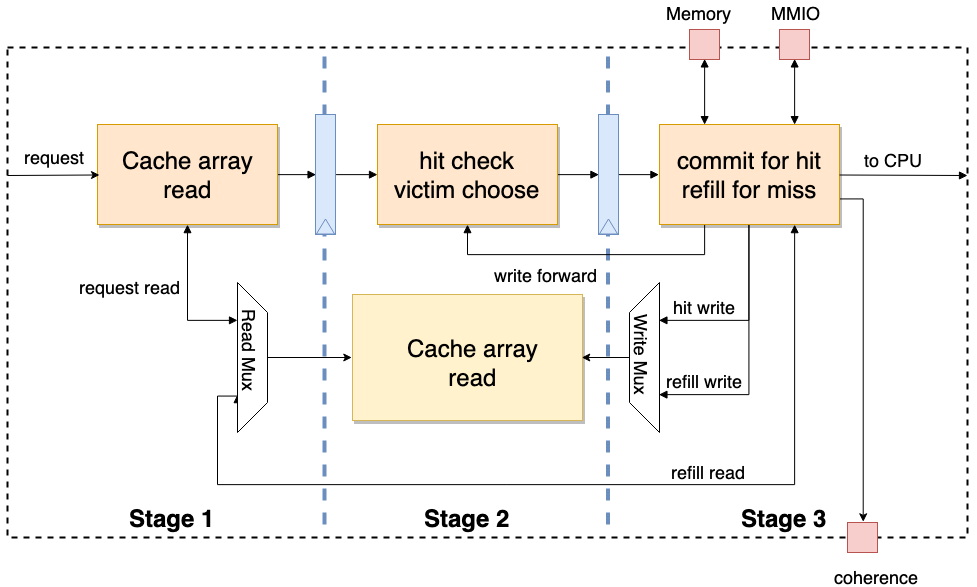

新手课程的最后任务是用 Toffee 对果壳 Cache 进行验证，在完成新手教程全部内容的学习之后，需要提交果壳 Cache 的验证代码仓库和验证报告。

# 开始新的验证任务

使用 toffee，你已经可以搭建出一个完整的验证环境，并且方便地去编写测试用例了。然而在实际的业务中，往往无法理解如何开始上手，并最终完成验证任务。实际编写代码后，会遇到无法正确划分 Bundle，无法正确理解 Agent 的高级语义封装，搭建完环境之后不知道做什么等问题。

在这一节中，将会介绍如何从头开始完成一个新的验证任务，以及**如何更好地使用 toffee** 来完成验证任务。

1. 了解待验证设计

拿到一个新的设计后，往往面对的是几十或数百个输入输出信号，如果直接看这些信号，很可能一头雾水，感觉无从下手。在这时，你必须坚信，输入输出信号都是设计人员来定义的，只要能够理解设计的功能，就能够理解这些信号的含义。

如果设计人员提供了设计文档，那么你可以阅读设计文档，了解设计的功能，并一步步地将功能与输入输出信号对应起来，并且要清楚地理解输入输出信号的时序，以及如何使用这些信号来驱动设计。一般来说，你还需要阅读设计的源代码，来找寻更细节的接口时序问题。

当大致了解了 DUT 的功能，并明白如何驱动起 DUT 接口之后，你就可以开始搭建验证环境了。

2. 划分 Bundle

搭建环境的第一件事，就是根据接口的逻辑功能，将其划分为若干个接口集合，我们可以每一个接口集合视作一个 Bundle。划分为的每个 Bundle 都应是独立的，由一个独立的 Agent 来驱动。

但是，往往实际中的接口是这样的：

```bash
|---------------------- DUT Bundle -------------------------------|

|------- Bundle 1 ------| |------ Bundle 2 ------| |-- Bundle 3 --|

|-- B1.1 --| |-- B1.2 --| |-- B2.1 --|
```

那么问题就出现了，例如究竟是应该为 B1.1， B1.2 各自创建一个 Agent，还是应该直接为 Bundle 1 建立一个 Agent 呢？

这还是取决于接口的逻辑功能，如果需要定义一个独立的请求，这个请求需要对 B1.1 和 B1.2 同时进行操作，那么就应该为 Bundle 1 创建一个 Agent，而不是为 B1.1 和 B1.2 分别创建 Agent。

即便如此，为 B1.1 和 B1.2 定义 1.2 也是可行的，这增添了 Agent 的划分粒度，但牺牲了操作的连续性，上层代码和参考模型的编写都会变得复杂。因此选择合适的划分粒度是需要对具体业务的权衡。最终的划分，所有的 Agent 加起来应该能覆盖 DUT Bundle 的所有接口。

实践中，为了方便 DUT 的连接，可以定义一个 `DUT Bundle`，一次性将所有的接口都连接到这个 Bundle 上，由 Env 将其中的子 Bundle 分发给各个 Agent。

3. 编写 Agent

当 Bundle 划分完成后，就可以开始编写 Agent 来驱动这些 Bundle 了，你需要为每个 Bundle 编写一个 Agent。

首先，可以从驱动方法开始写起，驱动方法实际上是对 Bundle 的一种高级语义封装，因此，高级语义信息应该携带了足以驱动 Bundle 的所有信息。如果 Bundle 中存在一个信号需要数字，但参数中并没有提供与这一信号相关的信息，那么这种高级语义封装就是不完整的。应尽量避免在驱动方法中对某个信号值进行假定，如果对这一信号在 Agent 中进行假定，DUT 的输出将会受到这一假定的影响，可能导致参考模型与 DUT 的行为不一致。

同时，这一高层封装也决定了参考模型的功能层级，参考模型会直接与高层语义信息进行交互，并不会涉及到底层信号。

如果参考模型需要用函数调用模式编写，那么应该将 DUT 的输出通过函数返回值来返回。如果参考模型需要用独立执行流模式编写，那么应该编写监测方法，将 DUT 的所有输出转换成高层语义信息，通过监测方法输出。

4. 封装成 Env

当所有的 Agent 编写完成后，或者挑选之前已有的 Agent，就可以将这些 Agent 封装成 Env 了。

Env 封装了整个验证环境，并确定了参考模型的编写规范。

5. 编写参考模型

参考模型的编写没有必要在 Env 编写完成之后再开始，可以与 Agent 的编写同时进行，并实时编写一些驱动代码，来检验编写的正确性。当然如果 Agent 的编写特别规范，编写完整 Env 后再编写参考模型也是可行的。

参考模型最重要的是选择合适的编写模式，函数调用模式和独立执行流模式都是可行的，但在不同的场景下，选择不同的模式会更加方便。

6. 确定功能点及测试点

编写好 Env 以及参考模型后，并不能直接开始编写测试用例，因为此时并没有测试用例的编写方向，盲目的编写测试用例，没有办法让待测设计验证完全。

> 💡功能点和测试点的整理，可以参考[第一讲·深入剖析：功能点和测试点的整理](../1-basis/#深入剖析功能点和测试点的整理)的内容。

7. 编写测试用例

当功能点及测试点列表确定后，就可以开始编写测试用例了，一个测试用例需要能够覆盖一个或多个测试点，以验证功能点是否正确。所有的测试用例应该能够覆盖所有的测试点（功能覆盖率 100%），以及覆盖所有的设计行（行覆盖率 100%），这样一来就能保证验证的完备性。

如何保证验证的正确性呢？如果采用参考模型比对的方式，当比对失败时，toffee 会自动抛出异常，使得测试用例失败。如果采用直接比对的方式，应该在测试用例中使用 `assert` 来编写比对代码，当比对失败时，测试用例也会失败。最终，当所有的测试用例都通过时，意味着功能已验证为正确。

编写过程中，你需要使用 `Env` 中提供的接口来驱动 DUT，如果出现了需要多个驱动方法交互的情况，可以使用 `Executor` 来封装更高层的函数。也就是说驱动方法级的交互，是在测试用例的编写中完成的。

8. 编写验证报告

当行覆盖率和功能覆盖率都达到了 100% 之后，意味着验证已经完成。最终需要编写一个验证报告，来总结验证任务的结果。如果验证出了待测设计的问题，也应在验证报告中详细描述问题的原因。如果行覆盖率或者功能覆盖率没有达到 100%，也应在验证报告中说明原因，报告的格式应该遵循公司内部统一的规范。

# 生成果壳 Cache 的 DUT

## 果壳 cache

果壳 cache（Nutshell Cache）是果壳处理器中使用的缓存模块。其采用三级流水设计，当第三级流水检出当前请求为 MMIO 或者发生重填（refill）时，会阻塞流水线。同时，果壳 cache 采用可定制的模块化设计，通过改变参数可以生成存储空间大小不同的一级 cache（L1 Cache）或者二级 cache（L2 Cache）。此外，果壳 cache 留有一致性（coherence）接口，可以处理一致性相关的请求。

<center></center>

## Chisel 与果壳

准确来说，Chisel 是基于 Scala 语言的高级硬件构造（HCL）语言。传统 HDL 是描述电路，而 HCL 则是生成电路，更加抽象和高级。同时 Chisel 中提供的 Stage 包则可以将 HCL 设计转化成 Verilog、System Verilog 等传统的 HDL 语言设计。配合上 Mill、Sbt 等 Scala 工具则可以实现自动化的开发。

>  💡如果你并不熟悉Chisel语言，可以先浏览[Chisel Bootcamp](https://mybinder.org/v2/gh/freechipsproject/chisel-bootcamp/master)的前三章内容，快速熟悉Chisel的语法。

果壳是使用 Chisel 语言模块化设计的、基于 RISC-V RV64 开放指令集的顺序单发射处理器实现。果壳更详细的介绍请参考链接：<https://oscpu.github.io/NutShell-doc/>

## Chisel 转 Verilog

Chisel 中的`stage`库可以帮助由 Chisel 代码生成 Verilog、System Verilog 等传统的 HDL 代码。以下将简单介绍如何由基于 Chisel 的 cache 实现转换成对应的 Verilog 电路描述。

请先保证完成 JDK 环境的配置！

> ⚠️警告：JDK 的版本≥21 会出现编译报错！

本教程示例操作均在 `cache-ut` 目录下进行：

```bash
mkdir cache-ut
cd cache-ut
```

### 配置 Mill

> ⚠️警告：以下内容参考2025年08月04日15:22访问的 [Mill - Installation & IDE Setup/Bootstrap Scripts](https://mill-build.org/mill/cli/installation-ide.html) 部分，如果下面内容失效，请以 [Mill 文档](https://mill-build.org/mill/index.html)的内容为主！

在 `cache-ut` 目录下执行以下命令：
```bash
curl -L https://repo1.maven.org/maven2/com/lihaoyi/mill-dist/1.0.2/mill-dist-1.0.2-mill.sh -o mill
chmod +x mill
echo "//| mill-version: 1.0.2" > build.mill
./mill version
```

如果最后几行包含：
```bash
Mill Build Tool version 1.0.2
```

代表已经配置好 mill 了。

### 初始化果壳环境

回到 `cache-ut` 文件夹中，然后从源仓库下载整个果壳源代码，并进行初始化：

```bash
git clone https://github.com/OSCPU/NutShell.git
cd NutShell && git checkout 97a025d
make init
```

### 创建 scala 编译配置

在 `cache-ut` 目录下创建 `build.sc`，其中内容如下：

```scala
import $file.NutShell.build
import mill._, scalalib._
import coursier.maven.MavenRepository
import mill.scalalib.TestModule._

// 指定Nutshell的依赖
object difftest extends NutShell.build.CommonNS {
  override def millSourcePath = os.pwd / "NutShell" / "difftest"
}

// Nutshell 配置
object NtShell extends NutShell.build.CommonNS with NutShell.build.HasChiselTests {
  override def millSourcePath = os.pwd / "NutShell"
  override def moduleDeps = super.moduleDeps ++ Seq(
        difftest,
  )
}

// UT环境配置
object ut extends NutShell.build.CommonNS with ScalaTest{
    override def millSourcePath = os.pwd
    override def moduleDeps = super.moduleDeps ++ Seq(
        NtShell
    )
}
```

### 实例化 cache

创建好配置信息后，按照 scala 规范，在 `cache-ut` 目录下创建 `src/main/scala` 源代码目录。

之后，就可以在 `cache-ut` 目录下创建`src/main/scala/nut_cache.scala`，利用如下代码实例化 Cache 并转换成 Verilog 代码：

```scala
package ut_nutshell

import chisel3._
import chisel3.util._
import nutcore._
import top._
import chisel3.stage._

object CacheMain extends App {
  (new ChiselStage).execute(args, Seq(
      ChiselGeneratorAnnotation(() => new Cache()(CacheConfig(ro = false, name = "tcache", userBits = 16)))
    ))
}
```

### 生成 RTL

完成上述所有文件的创建后，在 `cache-ut` 目录下执行如下命令：

```bash
mkdir build
./mill --no-server -d ut.runMain ut_nutshell.CacheMain --target-dir build --output-file Cache
```

上述命令成功执行完成后，会在 build 目录下生成 verilog 文件：`Cache.v`。

之后就可以通过 picker 工具进行 `Cache.v` 到 Python 模块的转换。除去 Chisel 外，其他 HCL 语言几乎都能生成对应的 RTL 代码，因此上述基本流程也适用于其他 HCL。

# 验证果壳 Cache

在学习了前述的知识后，相信你已经对硬件验证的方法有了一定的概念，请进行一次实战吧！请你对果壳 Cache 进行验证，撰写验证代码和测试报告，并在 UnityChipForXiangShan 的[ github 讨论板块](https://github.com/XS-MLVP/UnityChipForXiangShan/discussions/13)提交验证报告和代码。报告内容应当包含功能梳理、测试点分解、测试用例编写、验证结果分析和验证结论等。

验证报告的格式可以参考先前的[果壳 Cache 验证案例](https://github.com/XS-MLVP/Example-NutShellCache/blob/master/nutshell_cache_report_demo.pdf)完成您的验证。

> 在开始验证之前，推荐先通读一遍 picker 和 toffee 的文档

