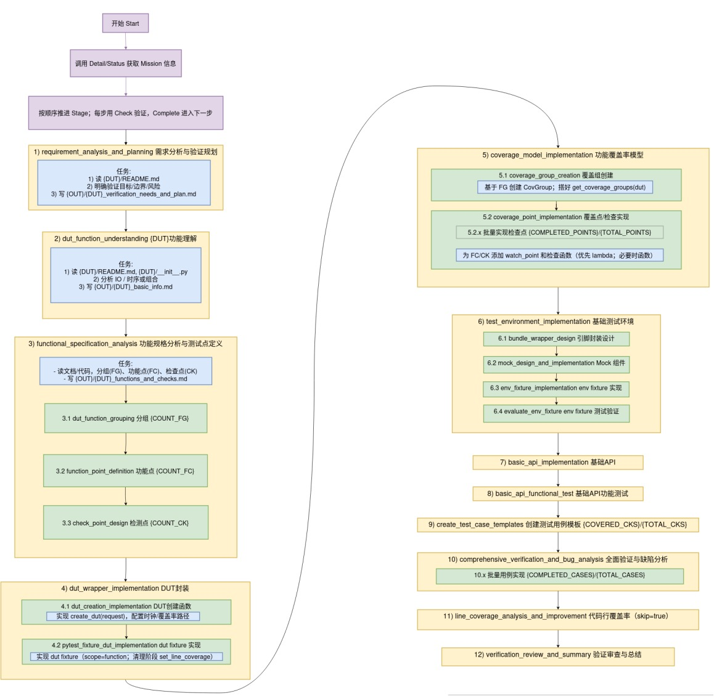

**UCAgent 是“万众一芯”推出的一个基于大语言模型的自动化芯片验证智能体。**
UCAgent 专注于芯片设计的单元测试(Unit Test)验证工作，可以自动分析硬件设计，生成测试用例，并执行验证任务生成测试报告，**让单元级硬件验证进入智能化新阶段。**

UCAgent 仓库地址：[https://github.com/XS-MLVP/UCAgent](https://github.com/XS-MLVP/UCAgent)

UCAgent 使用手册：[https://open-verify.cc/mlvp/docs/ucagent](https://open-verify.cc/mlvp/docs/ucagent)

**一、UCAgent 的能力与特点**
UCAgent 提供了完整的 Agent 与 LLM 交互逻辑，并集成了丰富的文件操作工具，可通过标准化API与大语言模型进行直接交互。
除此之外，UCAgent 还可以通过 MCP 协议与通用 Agent 进行深度协同。它具备以下三个特点：

- **单模块100%自动验证**: 对于简单电路（约1000行Verilog代码以下），UCAgent 可以实现100%自动化验证，不需要人力参与；
  对于复杂电路，通过人机协同，也能够完成验证。

- 支持常见 Code Agent: 现有编程类 AI Agent（如 OpenHands、Copilot、Claude Code、Gemini-CLI、Qwen-Code 等）**可以
  通过 MCP 协议与 UCAgent 进行深度协同，实现更优的验证效果和更高的自动化程度**。

- 工作流程可自由定制: **UCAgent 采用了一套灵活的验证流程配置机制**，整体工作流可由用户自行配置，增删包括主阶段，
  子阶段，checker在内的流程，**支持用户根据不同的应用场景和验证来调整验证阶段。**

**二、UCagent 的安装与使用**

UCAgent有两种使用模式，一种是直接使用本地 cli 配合大模型的直接使用方式；另一种是 UCAgent 提供 MCP-server 和 code agent 组合使用的MCP模式。相比之下，我们更推荐后者。因为目前 code agent 能力更加强大，能够更好地满足我们的需求和完成任务。

安装教程：MCP集成模式（推荐）：[https://open-verify.cc/mlvp/docs/ucagent/usage/mcp](https://open-verify.cc/mlvp/docs/ucagent/usage/mcp/)

安装教程：直接使用模式：[https://open-verify.cc/mlvp/docs/ucagent/usage/direct](https://open-verify.cc/mlvp/docs/ucagent/usage/direct/)

在《UCagent实操指南》中，详细演示了UCAgent 的安装、配置和使用方法：

<iframe src="//player.bilibili.com/player.html?isOutside=true&aid=115501887920813&bvid=BV1rB2FBJEHG&cid=33753466384&p=1&poster=1&autoplay=0" scrolling="no" border="0" frameborder="no" framespacing="0" allowfullscreen="true" style="width:80%; aspect-ratio: 16/9"></iframe>

**三、UCagent 试用案例**

目前，我们提供了8个例子，欢迎大家进行试用体验，其中包括7个全自动化验证的例子，1个人机协同的例子，包含了 verilog 和 chisel 模块。案例在持续增加中，欢迎大家贡献issue反馈和PR。（仓库地址：[https://github.com/XS-MLVP/UCAgent](https://github.com/XS-MLVP/UCAgent)）

- **案例地址：** https://github.com/XS-MLVP/UCAgent/tree/main/examples

- **自动化验证模块：**

1. Adder：16行Verilog
2. ALU754：657行Verilog
3. FSM：45行Verilog
4. HPerfCounter：285行Verilog
5. IntegerDivider：434行 (Scala源码) + 1024行 (生成的Verilog)
6. Mux：15行verilog
7. ShiftRegister：27行verilog

- **人机协同验证模块：**

1. DualPort：115行Verilog
