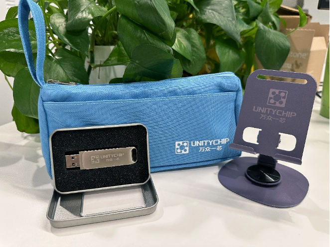

**Welcome to the Unity Chip Beginner Village**. Whether you are a first or second-year computer science student, a hardware engineer looking to try innovative verification methods, or a software engineer curious about open-source chips, you can **formally enter the world of chip verification through this simple and easy-to-learn beginner task** and explore the world of open-source processors.

## 1. How to Participate in Beginner Tasks

+ **Step1**: [Click here](https://www.wjx.top/vm/P7MqjP0.aspx# ) to fill out the registration form.

+ **Step2**: Receive an email and join the Beginner Task discussion group (QQ Group: 1033196714).

+ **Step3**: Follow the beginner tutorial and gradually start learning and hands-on tasks.

+ **Step4**: Submit verification code and verification report to complete the beginner task.

## 2. What Does the Beginner Task Include?

The beginner task **consists of learning + hands-on practice**.

After completing 4 lectures of learning, you will conduct a hands-on practice on Nutshell Cache, and finally submit the corresponding verification code and verification report.

**After your results are reviewed and approved, you can receive a "Unity Chip" souvenir package worth 99 yuan. It includes 1 custom double-layer pencil case, 1 rotating metal phone stand, and 1 32GB dual-interface USB drive.**

## 3. What Does the Beginner Tutorial Include?

The beginner tutorial consists of 5 lectures in total, starting from the basic knowledge of chip verification, gradually explaining the installation and usage of tools, and finally guiding everyone through a hands-on case. **Through these 5 lectures of learning, you will be able to complete this beginner task and successfully enter the world of chip verification!**

+ Lecture 1: Basic Knowledge of Chip Verification

+ Lecture 2: Picker Installation and Usage

+ Lecture 3: Toffee Installation and Usage

+ Lecture 4: Advanced Case: Dual-port Stack

+ Lecture 5: Hands-on Case - Nutshell Cache

Each beginner lecture includes **video explanations, text tutorials, and learning tasks**. You can check the specific content and start learning on the [Beginner Course Page](https://open-verify.cc/beginner/task/course/)~

### Basic Tools

As the saying goes, "To do a good job, one must first sharpen their tools." Considering the entry barriers in hardware verification, Wanzhong Yixin has prepared a tool called Picker—a tool that converts DUT written in hardware language into DUT written in software language—along with related tutorials, as shown below:

**Introduction to Picker**: Learn the principles of Picker, methods for converting the module under test into a Python module using Picker, basic data structure definitions, etc. (<a href="/mlvp/docs/env_usage/picker_usage/" target="_blank">Tutorial Link</a>).

**Waveform Generation**: Learn the methods for generating waveforms and post-processing using Picker. If possible, you can check the generated waveform diagrams in this section (<a href="/mlvp/docs/env_usage/wave/" target="_blank">Tutorial Link</a>).

**Multi-File Input**: Learn how to use Picker to handle scenarios with multiple file inputs, enabling the conversion of modules with multiple dependencies (<a href="/mlvp/docs/env_usage/multifile/" target="_blank">Tutorial Link</a>).

**Coverage Statistics**: Understand how to use Picker to generate test coverage based on Verilator simulation (<a href="/mlvp/docs/env_usage/coverage/" target="_blank">Tutorial Link</a>).

**Test Framework Integration**: Learn how to integrate picker with existing test frameworks (including pytest and hypothesis) (<a href="/mlvp/docs/env_usage/frameworks/" target="_blank">Tutorial Link</a>).

## Learning Task 2: Verification Environment and DUT Encapsulation

In addition to directly manipulating the DUT for verification, UnityChip also provides a pytest-based verification framework called toffee. Following the learning arrangement of this task, you will first understand the general environment configuration methods and complete test cases using conventional methods, including an adder, a random number generator, and a dual-port stack tested in two ways. After that, the course will introduce how to install the toffee framework and the process of building a verification environment based on the toffee framework.

### Case Demonstration

To further demonstrate the method of verifying hardware using software languages, this section will present four simple cases, including an adder, a random number generator, and a dual-port stack as DUTs. For the dual-port stack, both coroutine and callback verification methods will be demonstrated.

**Environment Preparation**: To perform verification, it is necessary to first configure picker support in the environment. For specific instructions, please refer to <a href="/mlvp/docs/quick-start/installer/" target="_blank">this tutorial</a>.

**Adder**: This case presents a minimal adder and will use Picker to test it, thereby fully demonstrating the process of module verification using Picker. Click <a href="/mlvp/docs/quick-start/eg-adder/" target="_blank">here</a> to read the complete tutorial.

**Random Number Generator**: The previous adder case was a simple combinational logic circuit. Next, the course will demonstrate how to use Picker to verify a sequential logic circuit through the validation of the random number generator case. Click <a href="/mlvp/docs/quick-start/eg-rmg/" target="_blank">here</a> to read the complete tutorial.

**Callback-Based Dual-Port Stack Verification**: The previous two cases were small in scale and linear, not involving concurrency issues. However, the course will now present a concurrent case: the dual-port stack, and provide two verification methods: callback functions and coroutines. The callback-based verification method drives the DUT by registering callback functions and simulating a state machine. However, this callback-driven approach splits the DUT's logic into multiple states and function calls, significantly increasing complexity and imposing requirements on code writing and debugging. Click <a href="/mlvp/docs/quick-start/eg-stack-callback/" target="_blank">here</a> to read the complete tutorial.

**Coroutine-Based Dual-Port Stack Verification**: In addition to the callback function method, the dual-port stack can also be verified using coroutines, which better preserves independent execution flows. However, synchronization and management between coroutines can present significant challenges. This is one of the reasons behind the development of the Toffee testing framework by WanZhongYiXin. Click <a href="/mlvp/docs/quick-start/eg-stack-async/" target="_blank">here</a> to read the complete tutorial on dual-port stack coroutine verification.

### Toffee Tool Installation

Next, the course will introduce the testing framework developed by WanZhongYiXin for the Python language: Toffee (along with the accompanying Toffee-Test). This framework is built on the DUT packaged by Picker, further encapsulating data responsibilities and functional responsibilities, while also encapsulating complex hardware cycle logic, greatly simplifying the code writing for developers.

To use this tool, you first need to configure Toffee. The installation of Toffee depends on Python version 3.6.8 or higher and Picker version 0.9.0 or higher. After configuring the dependencies, you can install Toffee locally using pip or by downloading it directly from the Git repository. For detailed installation instructions, please refer to <a href="/mlvp/docs/mlvp/quick-start/" target="_blank">here</a>.

### Standard Verification Environment

One of the core purposes of toffee is to standardize the verification environment. Therefore, toffee focuses on the reusability of test cases by encapsulating the data responsibilities of the DUT into Bundles. Similarly, with reusability in mind, Toffee splits the behavioral responsibilities of the DUT into multiple Agents. Lastly, to facilitate better result comparison, toffee provides a reference model mechanism that allows the framework to use the tester's reference model code for verification. For detailed specifications of the verification environment and toffee's design philosophy, please refer to <a href="/mlvp/docs/mlvp/canonical_env/" target="_blank">this document</a>.

### Building Verification Code Using the Toffee Framework

This section will present an example demonstrating how to use Toffee to set up a testing environment for a complex DUT, supporting the creation of an environment that encapsulates both data responsibilities and behavioral responsibilities, while asynchronously testing a DUT.

The following is a brief overview of the <a href="/mlvp/docs/mlvp/env/" target="_blank">tutorial</a> outlining the steps for setting up the environment.

1\. Toffee incorporates Python's coroutine mechanism to build an asynchronous environment, so it's important to have a basic understanding of Toffee's asynchronous and clock mechanisms. Please read <a href="/mlvp/docs/mlvp/env/start_test" target="_blank">this tutorial</a> to establish the fundamental concepts.

2\. Toffee aims to encapsulate the data responsibilities of the DUT to enhance the reusability of test cases, leading to the development of the Bundle mechanism. Please read <a href="/mlvp/docs/mlvp/env/bundle" target="_blank">this tutorial</a> to learn how to write Bundles.

3\. Toffee has achieved a high-level encapsulation of signal processing logic within a class of Bundles, allowing the upper layers to drive and monitor signals in the Bundle without worrying about the specific signal assignments. This is known as an Agent. Please read <a href="/mlvp/docs/mlvp/env/agent" target="_blank">this tutorial</a> to understand how to write Agents.

4\. Toffee further provides support for packaging the entire verification environment to instantiate the Agents defined in the previous step. This is accomplished by the Env. Please read <a href="/mlvp/docs/mlvp/env/build_env" target="_blank">this tutorial</a> to learn more about the related content.

5\. When the output is not clearly defined, testers need to write reference models. The toffee framework provides two ways to implement reference models: function call and independent execution flow. Both types of reference models can validate the execution results during the process. Please read <a href="/mlvp/docs/mlvp/env/ref_model" target="_blank">this tutorial</a> to learn how to write reference models.

## Learning Task 3: Writing Test Cases

Once the environment is set up, you can start writing test cases. In this learning task, the course aims for you to understand the following concepts:

**Driving with Test Environment Interfaces**: If there is only one driving function, you can call it directly. However, what if there are multiple driving functions? Toffee provides an asynchronous executor to make it easier for users to call multiple driving methods. Please read <a href="/mlvp/docs/mlvp/cases/executor/" target="_blank">this tutorial</a> for more details.

**Managing Test Cases with pytest**: Toffee uses pytest to effectively manage test cases and test suites. You can learn more about this in <a href="/mlvp/docs/mlvp/cases/pytest/" target="_blank">this tutorial</a>.

**Functional Checkpoints**: How can you determine the quality of a test? **Test coverage** is a commonly used metric for evaluating test quality. Among these, line coverage can be analyzed automatically, but functional coverage requires manually adding checkpoints for assessment. Therefore, Toffee provides a set of checkpoint mechanisms. Please read <a href="/mlvp/docs/mlvp/cases/cov/" target="_blank">this tutorial</a> to learn more.

## Learning Task 4: BPU Practice

After learning the aforementioned concepts, you should have a certain understanding of hardware verification methods. Now, let’s put it into practice! Please select at least one submodule of the validated Xiangshan BPU for verification. Write the verification code and a test report, and submit the verification report and code in the <a href="https://github.com/XS-MLVP/UnityChipForXiangShan/discussions/13" target="_blank">GitHub discussion section</a> for UnityChipForXiangShan. The report should include functional analysis, breakdown of test points, test case development, analysis of verification results, and verification conclusions.

You can refer to the format of the <a href="https://github.com/XS-MLVP/Example-NutShellCache/blob/master/nutshell_cache_report_demo.pdf" target="_blank">NutShell Cache verification case</a> to complete your validation report.

## Other Considerations

When you participate in any activities organized by "One Chip for All," you can earn a reward of around 1,000 yuan for identifying bugs in the Xiangshan processor, depending on the nature of the bugs.

## Registration Link
[Click here](https://www.wjx.top/vm/YEbqmTM.aspx) to fill out the application form. After submission, join the QQ group (Group ID: <b>1033196714</b>) to contact us.